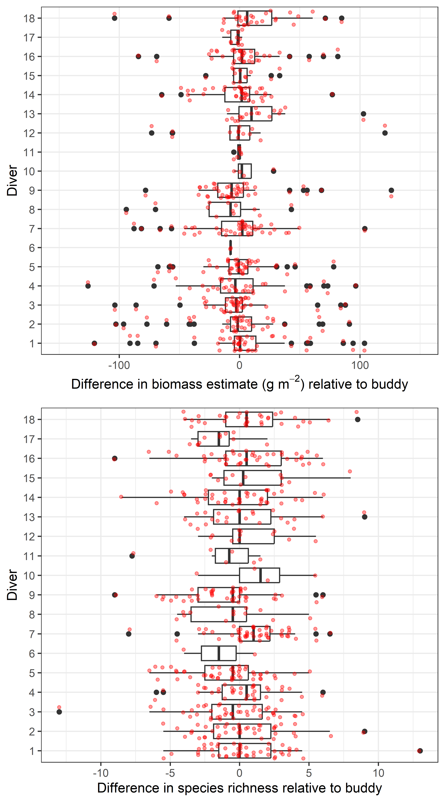
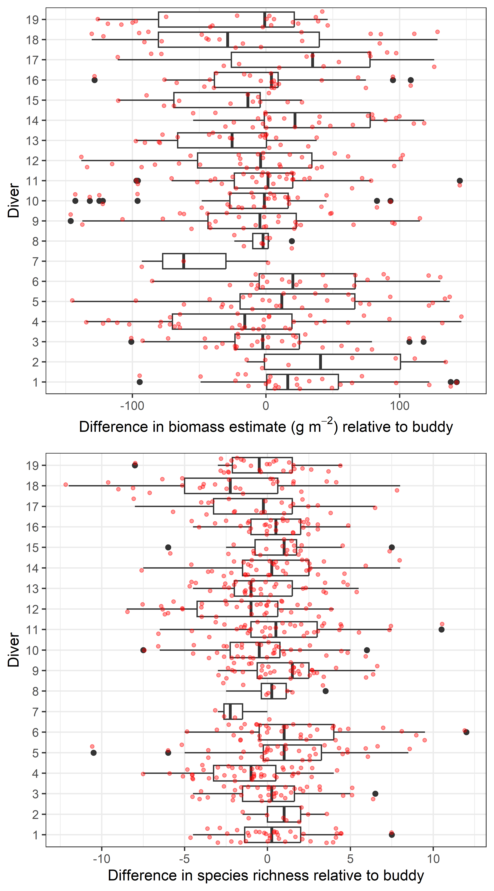

::: {.landscape}
# Appendix A: Surveys per region per year {.appendix #sec-appA}
```{r}
#| echo: false
#| message: false
#| warning: false
#| label: tbl-year-n
#| tbl-cap: The number of SPC sites surveyed in Hawai‘i per year.  The SPC data collected prior to 2009 are not used in this report because the sites were not selected based on the randomized depth stratified design (see Methods). Furthermore, during the methods transition period, the sites surveyed at the mid-depth strata in 2009 were the haphazardly selected fixed sites from the previous years. Shallow and deep sites were randomly selected. Here, we report all data from 2009 onward, including the non-randomized mid-depth 2009 sites. In the future, these mid-depth sites should be excluded from any time series analyses.

# make a table of number of survey sites per year
# load library and data
library(kableExtra)
library(dplyr)
library(tidyr)
load("data/Data Outputs/working_site_data.rdata")
options(knitr.kable.NA = "-")
# make a pivot table
site<-wsd %>% group_by(REGION, OBS_YEAR)  %>% 
  count()
sit<-site %>% dplyr::rename("Year" = OBS_YEAR, "Number of surveys" = n, Region = REGION) 
sit$Region<- recode(sit$Region, MHI ="Main Hawaiian Islands",NWHI = "Papahānaumokuākea")

# Reshape to wide format
wide <- sit %>%
  pivot_wider(
    names_from = Year,  # Column whose values will become new column names
    values_from = "Number of surveys" # Column whose values will fill the cells
  )
# reorder columns
w<-wide %>% select("Region", "2009","2010","2011","2012","2013","2014","2015","2016","2017","2019","2024")
# Make the table, including:
# aligning the text in keeping with the PIFSC template
kable(w,
      align = "rr")

```
:::
# Appendix B: Samples per sector and strata in 2024 {.appendix #sec-appB}

```{r}
#| echo: false
#| message: false
#| warning: false
#| label: tbl-mhi-sector-n
#| tbl-cap: The number of sites surveyed per depth strata and the sector used to pool the data in island-level parameter estimates for the main Hawaiian islands. During the site selection process, site locations are randomly selected from the strata area for each island. In the main Hawaiian islands, the islands are broken down into smaller sectors. Deep (>18–30 m), mid (>6–18 m), and shallow (>0–6 m).

# make a table of number of survey sites per sector and strata in 2024
# load library and data
library(dplyr)
library(tidyr)
load("data/Data Outputs/working_site_data.rdata")

# make a pivot table
site<-wsd %>% filter(OBS_YEAR == "2024"&REGION == "MHI") %>% group_by( ISLAND,SEC_NAME, DEPTH_BIN)  %>% 
  count()
sit<-site %>% dplyr::rename("Island" = ISLAND, "Sector" = SEC_NAME,"Number of surveys" = n) 
#sit$Region<- recode(sit$Region, MHI ="Main Hawaiian Islands",NWHI = "Papahānaumokuākea")

# Reshape to wide format
wide <- sit %>%
  pivot_wider(
    names_from = DEPTH_BIN,  # Column whose values will become new column names
    values_from = "Number of surveys" # Column whose values will fill the cells
  )

# Make the table, including:
# aligning the text in keeping with the PIFSC template
kable(wide,
      align = "rr")
```

```{r}
#| echo: false
#| message: false
#| warning: false
#| label: tbl-nwhi-sector-n
#| tbl-cap: The number of sites surveyed per depth strata and reef zone used to pool the data in island-level parameter estimates for Papahānaumokuākea. During the site selection process, site locations are randomly selected from the strata area for each island. Deep (>18–30 m), mid (>6–18 m), and shallow (>0–6 m).

# make a table of number of survey sites per sector and strata in 2024
# load library and data
library(dplyr)
library(tidyr)
load("data/Data Outputs/working_site_data.rdata")

# make a pivot table
site<-wsd %>% filter(OBS_YEAR == "2024"&REGION == "NWHI") %>% group_by( ISLAND,REEF_ZONE, DEPTH_BIN)  %>% 
  count()
sit<-site %>% dplyr::rename("Island" = ISLAND, "Depth bin" = DEPTH_BIN,"Number of surveys" = n) 
#sit$Region<- recode(sit$Region, MHI ="Main Hawaiian Islands",NWHI = "Papahānaumokuākea")

# Reshape to wide format
wide <- sit %>%
  pivot_wider(
    names_from = REEF_ZONE,  # Column whose values will become new column names
    values_from = "Number of surveys" # Column whose values will fill the cells
  )

# Make the table, including:
# aligning the text in keeping with the PIFSC template
kable(wide,
      align = "rr")
```
# Appendix C: SPC Quality control: Observer cross-comparison {.appendix #sec-appC}

Estimates are compared between dive partner pairs to check for consistency between observers. This can be done for any parameter estimated, but here total fish biomass, species richness (number of unique species counted), and hard coral cover estimates are highlighted. These are three of the most frequently reported summary metrics from the stationary point count survey data. The differences between the estimates of each diver and those of their dive partner at each site are calculated and referred to here as diver performance. Real differences between dive partners are expected as divers are survey adjacent, not in the same cylinder area. However, if there is no consistent bias in the estimates made by a diver, one would expect the median value of their performance to be close to zero, that is, with estimates in half of the counts being higher than their partner’s estimates and half of the counts lower than their partner’s estimates. Boxplots of diver performance, therefore, give the following: (1) a strong but general indication of relative bias; if there is no consistent bias, then the median differences between a single diver and their dive partners will be close to zero; and (2) an indication of how variable each diver’s counts are compared to their dive partners; if a particular diver’s performance varies widely compared to their partner’s (i.e., several very high and/or several very low counts), that may indicate variability in their performances. As dive teams are regularly rotated throughout the course of a survey mission, measures of individual diver’s counts reflect their performance relative to the entire pool of other divers participating in those surveys. These boxplots are routinely generated during and after field operations to give divers feedback on their performance relative to their colleagues and are summarized here by region.

```{r}
#| echo: false
#| message: false
#| warning: false
#| label: fig-divervdiver-MHI
#| fig-cap: "Comparison of observer diver vs. diver partner estimates in the main Hawaiian Islands for total fish biomass (top plot) and species richness (bottom plot) during the 2024 surveys. The boxplot shows the median difference (thick vertical line) in estimates for each diver. The box represents the location of 50% of the data. Lines extending from each box are 1.5 times the interquartile range, which represents approximately 2 standard deviations; points greater than this (outliers) are plotted individually (black dots)." 

# load data
load("data/Data Outputs/raw_working_data.rdata")
# load library functions
source("data/fish_team_functions.R")
source("data/Islandwide Mean&Variance Functions.R")
library(reshape)
## need to read in the species_table from Fish Base
#Pull all species information into a separate df, for possible later use ..
FISH_SPECIES_FIELDS<-c("SPECIES","TAXONNAME", "FAMILY", "COMMONFAMILYALL", "TROPHIC_MONREP", "LW_A", "LW_B", "LENGTH_CONVERSION_FACTOR")
species_table<-Aggregate_InputTable(wd, FISH_SPECIES_FIELDS)

## using Calc_REP functions (from fish_team_functions) to get richness and biomass estimates per replicate....
r1<-Calc_REP_Bio(wd, "FAMILY")
# #drop level UNKNOWN
#r1<-r1 %>% dplyr::select(-"UNKNOWN")
family.cols<-names(r1)[7:dim(r1)[2]]
r1$TotFish<-rowSums(r1[,family.cols])

r2<-Calc_REP_Species_Richness(wd)

UNIQUE_SURVEY<-c("SITE", "SITEVISITID","METHOD")
UNIQUE_REP<-c(UNIQUE_SURVEY, "REP")
UNIQUE_COUNT<-c(UNIQUE_REP, "REPLICATEID")
SURVEY_SITE_DATA<-c("DEPTH")

#r3<-Calc_REP_nSurveysArea(wd, UNIQUE_SURVEY,UNIQUE_REP,  UNIQUE_COUNT,SURVEY_SITE_DATA)

r3<-Calc_REP_nSurveysArea(wd, c("SITE", "SITEVISITID","METHOD"), c("SITE", "SITEVISITID","METHOD","REP"), c("SITE", "SITEVISITID","METHOD","REP","REPLICATEID"), c("REPLICATEID","DEPTH"))

COMPARE_ON<-c("SITEVISITID", "SITE", "REP", "REPLICATEID")
compdata<-merge(r1[,c(COMPARE_ON, "TotFish")], r2[,c(COMPARE_ON, "SPECIESRICHNESS")], by=COMPARE_ON, all.x=T)
compdata<-merge(compdata[,c(COMPARE_ON, "TotFish", "SPECIESRICHNESS")], r3[,c(COMPARE_ON)], by=COMPARE_ON, all.x=T)

## get year, region and island data
a<-unique(wd[,c("SITE","SITEVISITID","OBS_YEAR","ISLAND","REGION","REPLICATEID","DIVER","ANALYSIS_YEAR")])

test<-merge(compdata, a, by="REPLICATEID", all.x=T) ## this collates year, region etc. with the indiv diver ests per rep
compdata<-test

## need to rename some of the cols after the merge
names(compdata)<-c("REPLICATEID","SITEVISITID","SITE","REP","TotFish","SPECIESRICHNESS",
                   "SITE.y","SITEVISITID.y","OBS_YEAR","ISLAND","REGION","DIVER","ANALYSIS_YEAR")

# set wd
#setwd("/figures/appendix")

## divervsdiver4 - creates an anonymous and named version of diver comparisons for totfish, richness and coral estimates
##- need to look at the range of the data per year region to tweak the x axis range
dataAS<-compdata[compdata$ANALYSIS_YEAR==2024,]
summary(dataAS$TotFish)# look at max value for tot fish and adjust x_range below - may need to adjust for extreme outliers - CHANGE X_RANGE BELOW BASED ON THESE VALUES

# RENAME REGION TO AS
unique(dataAS$REGION)
## to create a multigraph with total fish, richness and coral estimates run divervsdiver3
divervsdiver4(data=dataAS, year = "2024", region="MHI", x_range= 150)
divervsdiver4(data=dataAS, year = "2024", region="NWHI", x_range= 150)

```


```{r}
#| echo: false
#| message: false
#| warning: false
#| label: fig-divervdiver-NWHI
#| fig-cap: "Comparison of observer diver vs. diver partner estimates in Papahānaumokuākea for total fish biomass (top plot) and species richness (bottom plot) during the 2024 surveys. The boxplot shows the median difference (thick vertical line) in estimates for each diver. The box represents the location of 50% of the data. Lines extending from each box are 1.5 times the interquartile range, which represents approximately 2 standard deviations; points greater than this (outliers) are plotted individually (black dots)." 

```

# Appendix D: Random stratified sites surveyed at each island per year {.appendix #sec-appD}

```{r}
#| echo: false
#| message: false
#| warning: false
#| label: tbl-isl-year
#| tbl-cap: The total number of sites surveyed per island per year under the stratified-random sampling design, using the stationary point count method to survey the fish assemblage.

# appendix D: random stratified sites surveyed per region / island  -------------####
library(reshape)
library(tidyr)
library(dplyr)
library(readr)
load("data/Data Outputs/clean_working_site_data_used_in_higher_pooling_for_report.Rdata")
site<-wsd.uncap

# SELECT relevant fields
test<-site %>% dplyr::select("REGION","OBS_YEAR","ISLAND","ANALYSIS_YEAR","SITE") %>% 
  group_by(OBS_YEAR,REGION,ISLAND) %>% 
  summarise(n=n())
head(test)

# hm<-cast(test, c(ISLAND)~OBS_YEAR)
# head(hm)
# hm<-hm %>% filter(ISLAND != "South Bank")

# make a pivot table
test<-test %>% dplyr::rename("Year" = OBS_YEAR, "Island" = ISLAND,"Region" = REGION) 
test$Region<- recode(test$Region, MHI ="Main Hawaiian Islands",NWHI = "Papahānaumokuākea")
test$n<-as.character(test$n)
# Reshape to wide format
wide <- test %>% arrange(Region) %>% 
  pivot_wider(
    names_from = Year,  # Column whose values will become new column names
    values_from = n, # Column whose values will fill the cells
    values_fill = "-"
    )

# Make the table, including:
# aligning the text in keeping with the PIFSC template
kable(wide,
      align = "rr")
```

# Contact us
We are committed to providing ecological monitoring information that is transparent, readily accessible, and relevant to the sound management of coral reef resources. For data requests contact: Andrew.Shantz@noaa.gov.

We would welcome comments from any users of this data report on how to improve the utility of this document for future versions. Comments or suggestions on the content of this annual data report may be submitted to: Kaylyn.McCoy@noaa.gov with the subject line, "Feedback on Monitoring Report."
