```{r}
#| echo: false
# update year 
ReportYear<-"2024"
# update region
ReportRegion<-"Hawaiʻi"

```
# Introduction {.unnumbered}

## Background {.unnumbered}

The Archipelagic Research Program (ARP) leads the
U.S. Pacific [National Coral Reef Monitoring Program](https://coralreef.noaa.gov/topics/national-coral-reef-monitoring-program) (NCRMP; @fig-map),
formerly known as the Pacific Reef Assessment and Monitoring Program
(RAMP). ARP provides scientific information that supports ecosystem
approaches to the management and conservation of coral reefs. 

From 2000–2011, the Pacific RAMP surveyed each region on a biennial
basis to establish baseline ecosystem assessments and conduct long-term
monitoring that integrates biological observations with water quality
and oceanographic data. In 2011, the [NOAA Coral Reef Conservation
Program](https://coralreef.noaa.gov/) (CRCP) established the NCRMP, and the Pacific RAMP was
integrated into this broader objective to monitor the status and trends
of all U.S. coral-reef ecosystems, including the Atlantic, Caribbean,
and Puerto Rico (NOAA CRCP, 2014). Starting in 2012, the Pacific
NCRMP transitioned to monitoring each region on a triennial cycle.

```{r}
#| echo: false
#| label: fig-map
#| fig-cap: "Coral-reef areas surveyed for the Pacific NCRMP. Shading indicates marine national monuments. ALT: A map of the Pacific Ocean showing the areas surveyed by Pacific NCMRP "
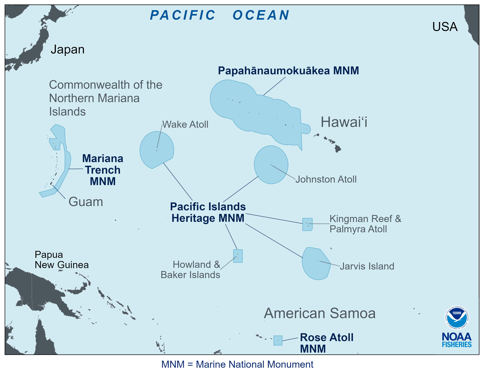
```

As an interdisciplinary monitoring program, the NCRMP has three main themes: biological, climate, and socioeconomic monitoring. The Pacific NCRMP executes the biological and climate components of hard-bottomed reef habitats in the 0–30 m depth range. Under the biological monitoring theme, the Pacific NCRMP collects the following reef-fish data for every observed species, including key fish taxa:   

* Abundance
* Size structure
* Diversity
* Distribution

Partnership and cooperation with other federal and jurisdictional management groups is a core principle of the NCRMP. For example, the [University of Guam’s Long-Term Coral Reef Monitoring Program](https://www.uog.edu/ml/ltmp) (GLTMP) conducts reef fish monitoring surveys around Guam using similar survey designs and methods. Therefore, data gathered by the GLTMP is readily merged with NCRMP data resulting in an increased survey domain for local research efforts. 

This report focuses on the data collected using the stationary point count (SPC) method to survey the fish assemblage (Methods[link to section in word]). Note that the Pacific NCRMP also collects benthic data via benthic transects in the same locations as SPC surveys, which are not included in this report (for more information access the NOAA Coral Program [2021]).

## Monitoring scope of the NCRMP {.unnumbered}

CRCP’s NCRMP includes the following biological monitoring goals:  

* Develop and implement consistent and comparable methods and standard operating procedures that detail specific field, laboratory, and/or analytical procedures and best practices for all indicators (with periodic updates to reflect new technologies or logistical considerations)
* Develop and maintain strong partnerships with federal, state/territory, and academic partners
* Collect scientifically sound, geographically comprehensive data in U.S. coral reef areas
* Deliver high‐quality data, data products, and tools to the coral reef conservation community
* Provide context for interpreting the results of localized monitoring
* Provide periodic assessments of the status and trends of the nation’s coral reef ecosystems
* Contribute to local capacity-building through its engagement of jurisdictional entities and private-public partnerships involved in NCRMP data collection

These goals are based on the key monitoring questions for the CRCP and NCRMP support for baseline observations and monitoring (NOAA Coral Reef Conservation Program, 2009; NOAA CRCP, 2014; NOAA Coral Program, 2021).

The Pacific NCRMP involves monitoring over very large spatial scales: ~40 islands and atolls spread over thousands of kilometers. The target for fish monitoring is to provide periodic snapshot assessments of coral-reef assemblages at U.S.-affiliated islands in the Pacific, with the core reporting unit being at the island scale (or sub-island scale for large islands). As such, the survey design and effort are optimized to generate data at the spatial scale of islands and atolls. Therefore, the NCRMP is explicitly a “wide-but-thin” survey program, with the aim of generating large-scale, regional status and trend information of the nation’s shallow (0–30 m) coral-reef ecosystems, to provide a broad-scale context and perspective for management and conservation.

## Report structure {.unnumbered}

This report summarizes the reef-fish survey data collected in `r ReportRegion` during the Pacific NCRMP survey mission in `r ReportYear`. This report incorporates reef fish data collected by the Papahānaumokuākea Marine National Sanctuary monitoring team, who use the same reef fish survey methods as the NCRMP. The status of reef-fish assemblages is described at the island scale and for larger islands at the sector scale. By collecting data using the same methods over time, we are able to provide time series that begin in 2009, when ARP started to consistently use SPC fish surveys. 

All data used in this report are available through NCRMP's [online data visualization tool](https://ncrmp.coralreef.noaa.gov/), CRCP's [digital corals page](https://coralreef.noaa.gov/digital-corals), or through [NOAA’s InPort data system for 2009 – 2012](https://www.fisheries.noaa.gov/inport/item/34515), and [2014 on](https://www.fisheries.noaa.gov/inport/item/34518). For all remaining data requests or inquiries, please contact Andrew.Shantz@noaa.gov.

# Methods {#sec-methods .unnumbered}

## Sampling domain and survey design {.unnumbered}

The target sampling domain is hard-bottom habitat in water shallower than 30 m (Table 1). All islands/atolls within the regions are stratified by reef zone (backreef, forereef, lagoon, protected slope) and depth zone: shallow (> 0–6 m), mid (> 6–18 m), and deep (> 18–30 m). Within the Main Hawaiian Islands, sampling is exclusively conducted in forereef habitats and each island is further stratified into sectors based on broad differences in oceanographic exposure, reef structure, and local human population density. In contrast, the Papahānaumokuākea Marine National Monument encompasses a broader range of habitats. Monitoring at Hōlanikū (Kure), Manawai (Pearl & Hermes), and Midway includes backreef and lagoon habitats in addition to forereefs, while the design at Lalo (French Frigate Shoals) incorporates all four primary reef zones, including protected slope. 

```{r}
#| echo: false
#| label: tab-terms
# # TABLES - formatting by hand is one way to insert a table. Columns are delineated by a vertical bar. A colon proceeds the table caption, and three colons are used for formatting table descriptive text  
```
table caption: Sampling terms and definitions

| **Term** | **Definition** | 
|-------------------|-----------------------------------|
| Sampling domain | Hard-bottom habitat in water less than 30 m depth. |
| Reporting unit | A collection of sample sites, typically an island or atoll and in some cases, small island groups or sectors of larger islands. |
| Sectors | Management units and stretches of coastline with broadly similar habitat attributes and local human population density|
| Reef zone | Backreef, forereef, lagoon, or protected slope |
| Depth zone | Shallow >0*–6 m; mid >6–18 m; deep >18–30 m |
| Strata | Combination of sectors, reef zone and depth zone—the pooling level for site estimates by reef area | 
| Sample site data | The average values of estimated observed quantities from the SPC surveys conducted at each site. These are typically derived from a single pair of simultaneous surveys. Sites are tied to geographic coordinates. | 

::: {custom-style="Table Descriptive Text"}
\*For practical reasons, sites in which the center point of the survey cylinder is shallower than 1.5 m are not surveyed.
:::

The number of sites to be surveyed per stratum is based on a weighting factor calculated from the proportional area per stratum per reporting unit (e.g., island) and the variance of the target output metrics (e.g., consumer group biomass and total fish biomass; @sec-fshgrp), in combination with the ship time allotted per island or atoll. The resulting target number of sites is then randomly distributed across each stratum. Details on the sampling effort across survey cruises are provided in @sec-appA.

## Site selection {.unnumbered}

Prior to each survey mission, sample site locations (latitude and longitude) are randomly drawn from geographic information system (GIS) habitat and strata maps of the entire sampling domain (@fig-strata).  

Maps used in the site selection procedure were created using information from the NOAA [National Centers for Coastal Ocean Science](https://coastalscience.noaa.gov/), reef zones (e.g., forereef) digitized from IKONOS satellite imagery or nautical charts, bathymetric data from the Pacific Islands Fisheries Science Center (PIFSC)-affiliated [Pacific Islands Benthic Habitat Mapping Center](https://www.soest.hawaii.edu/pibhmc/cms/) at the University of Hawaiʻi at Mānoa, and prior knowledge gained from previous visits to survey locations.   

Although the Pacific NCRMP aims to survey around the entirety of each island or atoll, the achieved monitoring effort is ultimately determined by field logistics and weather conditions encountered during field operations on each research cruise. If a site is not suitable (e.g., soft- as opposed to hard-bottomed habitat) or accessible (e.g., due to inclement sea conditions), the dive is aborted and an alternate (backup) site is picked from the randomized list. In some cases, the spatial coverage of sampling sites around the entire area of the target sampling domain is incomplete. As such, any inferences about coral-reef fish assemblages and habitat made at the island scale are only representative of the areas sufficiently surveyed (@sec-appB `r ReportYear`). For further details on the methods and maps used to select sites, go to (Ayotte et al. 2015 and Williams et al. 2011).

```{r}
#| echo: false
#| label: fig-strata
#| fig-cap: "An example of the benthic habitat and depth strata information used in the site-selection process. Each circle identifies a site that falls on hard substrata (green) in the three depth strata (see map legend; shallow, <6 m; mid, >6–18 m; and deep, >18–30 m). ALT: Map of an island with benthic substrate categories of land, hard substrate, soft substrate, and unknown habitat."
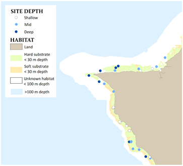
```

## Sampling Methods {.unnumbered}

At each survey site, divers record the counts and sizes of observed fish assemblages. The SPC protocol closely follows that used by Ault et. al. (2006) and involves a pair of divers conducting simultaneous counts in adjacent, visually estimated 15 m diameter cylindrical plots extending from the substrate to the limits of vertical visibility (@fig-spc). 

Prior to beginning each SPC, a 30 m line is laid across the substratum. Markings at 7.5 m, 15 m, and 22.5 m enable survey divers to locate the midpoint (7.5 m or 22.5 m) and two edges (0 m and 15 m or 15 m and 30 m) of their survey plots. Each count consists of two components. 

The first is a 5-minute species enumeration period in which the diver records the taxa of all species observed within their cylinder. At the end of the 5-minute period, divers begin the tallying portion of the count, where they systematically work through their species list and record the number and estimated size (total length [TL] to the nearest centimeter) of each individual fish. 

The tallying portion is conducted as a series of rapid visual sweeps of the plot, with one species-grouping counted per sweep. To the extent possible, divers remain at the center of their cylinders throughout the count. However, small, generally site-attached and semi-cryptic species—which tend to be under-represented in counts made by an observer remaining in the center of a 7.5-m radius cylinder—are left to the end of the tally period, at which time the observer swims through their plot area carefully searching for those species. In cases where a species is observed during the enumeration period but is not present in the cylinder during the tallying period, divers record their best estimates of size and number observed in the first encounter during the enumeration period and mark the data record as “non-instantaneous.” 

Beginning in 2012, divers also recorded observations of fishes that were first seen inside the cylinders at some point between 5 and 30 minutes into the survey. However, for consistency across time periods, those additional observations were not used in this report. Surveys are not conducted if horizontal visibility is less than 7.5 m, that is, when observers cannot distinguish the edges of their cylinder (Ayotte et al., 2015). 

```{r}
#| echo: false
#| label: fig-spc
#| fig-cap: "Side view of the stationary point count method. A pair of divers count and size the fishes within adjacent cylinders measuring 15 m in diameter. ALT: Two divers record fish data in a visually estimated cylinder with a 15-m diameter"
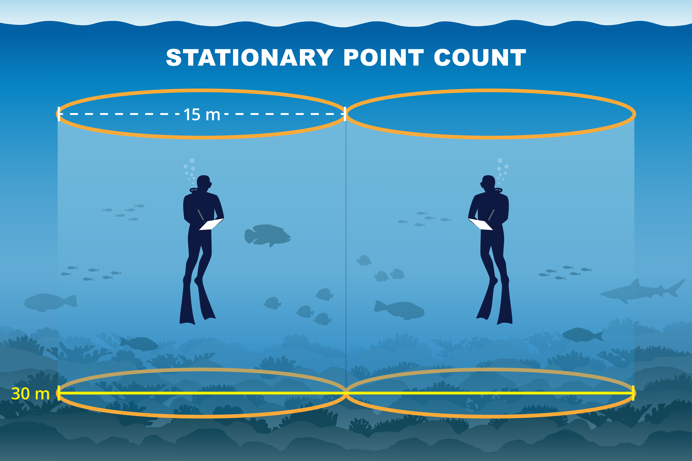
```

## Data entry and storage {.unnumbered}

Data are entered into a custom data entry application built with Oracle Application Express and stored in an Oracle mission-specific database. Upon completion of each monitoring cruise, all data are migrated to an existing master Oracle database that is stored on a server at the PIFSC.

## Data quality control {.unnumbered}

Data quality control is implemented at three main stages:

* Prior to conducting fish surveys for the Pacific NCRMP, each observer must take the full training course. In between field data collections, observers practice survey methods and take fish identification tests (@fig-data-process: Pre-field). 
* Checking for errors at the data entry stage (@fig-data-process: In the field) occurs on the cruise when observers check the data entered by their dive partner against their datasheet for typing and potential sizing errors. At the end of the cruise, a series of error checking scripts are run prior to migrating from the mission Oracle database to the master Oracle database (@fig-data-process: Post-field).  

Examining diver estimation accuracy occurs during and after the monitoring cruise when diver estimates are compared between dive partner pairs (@fig-data-process: In the field). Observer comparisons from the regions surveyed in `r ReportYear` are in @sec-appC.

```{r}
#| echo: false
#| label: fig-data-process
#| fig-cap: "The training, data collection, data processing, and reporting workflow for the Pacific NCRMP SPC surveys. ALT: Training, data collection, and data review process infographic"
knitr::include_graphics("Figures/Fig_4_data_process.tif")
```

## Data handling {.unnumbered}

### Calculating fish biomass per site {.unnumbered}

Using the count and size data collected per observer in each replicate survey, the body weight of each individual fish is calculated using length-to-weight (LW) conversion parameters and, where necessary, length-length (LL) parameters (for example, to convert TL to fork length [FL] for species with LW parameters based on FL). LW and LL conversion parameters were taken from FishBase (Froese & Pauly, 2010; Kulbicki et al., 2005). Biomass per fish is calculated using the standard length-weight equation. Herein, the term “biomass” refers to the aggregate body weight of a group of fishes per unit area (g m^–2^). Site is the base sample unit, and the estimated biomass of fishes per site is calculated by taking the mean value from the paired SPC surveys. 

### Fish groupings {.unnumbered #sec-fshgrp}

In this report, species data are summarized at several different levels: consumer group, total fish biomass (“all fishes”), parrotfish biomass, and average total length. Consumer groups are: “primary consumers” (herbivores and detritivores); “secondary consumers” (omnivores and benthic invertivores); “planktivores;” and “piscivores,” with classifications based on diet information taken largely from FishBase (Froese & Pauly, 2010). For parrotfish, data are presented for two size classes: 10–30 cm and greater than 30 cm TL, as 30 cm is the legal minimum size for fishing on all islands. 

### Generating island-scale estimates from the stratified design {.unnumbered}

Summary statistics (e.g., mean and variance) of survey metrics (e.g., biomass) are calculated by first averaging values within each stratum before calculating the reporting unit values. A weighted-average method to calculate summary statistics is used because survey strata vary in size within each reporting unit. 

Estimates of the mean and variance for each survey quantity considered are calculated based on the observed values at sampled sites within each stratum. Then, aggregate estimates of the quantities across all strata are calculated using these formulas: 

(1) Pooled mean biomass (*X*) across S strata:\
$$
\begin{align}
X = \Sigma^S_{1}(X_{i}*w_{i})
\end{align}
$$
(2) Pooled mean variance of mean biomass (*VAR*) across S strata:\
$$
\begin{align}
VAR = \Sigma^S_{1}(VAR_{i}*w^2_{i})
\end{align}
$$
where $$X_{i}$$ is the estimate of mean biomass within stratum *i*, $$VAR_{i}$$ is the estimated variance of $$X_{i}$$, and *wi* is the stratum-weighting factor. Strata weighting factors were based on the size of strata, that is, if a stratum is 50% of the total habitat area surveyed at an island, its weighting factor will be 0.5, and the total of all weighting factors in an island sums to 1 (Smith et al., 2011).

In this report, only data from sites surveyed under the stratified sampling design are used (i.e., data collected from 2009 onward; @sec-appD). In the rare cases where fewer than two sites were surveyed in a stratum during a reporting period, they were removed from the island-scale parameter estimates for that period. 

Island-scale values for total fish biomass (i.e., all fishes, fishes by size class) and biomass per consumer group, parrotfish size class, and species of interest (mean and variance) are calculated by year (Island status and trends [link to section in word]). 

All data handling and analyses were performed using raw site data extracted from the NOAA PIFSC Oracle database, processed using a set of routine processing scripts written in R (R Development Core Team, 2011; @fig-data-process: Post-field), and visualized using the ggplot2 package (Wickham, 2016). The site-level data used to generate all figures and summary statistics are available upon request.

# Island status and trends {.unnumbered #sec-island}
```{r}
#| echo: false
# # update the last sentence in this paragraph to reflect species of interest specific to each region   
``` 
This section summarizes SPC data collected at each island in `r ReportRegion` between 2010 and `r ReportYear`, when comparable methods were used. For each island within a region—if there was sufficient sampling for the year—the maps illustrate the SPC site-level data and a standard set of graphs. The graphs show summary information about the fish community at the island and reef zone (forereef, lagoon, protected slope) scale.

On each fish biomass graph for the forereef habitat, a reference line indicates the region-wide mean estimate across all surveyed years (2010–`r ReportYear`), which is provided as a relevant regional comparison for island-level estimates. Fish biomass estimates are shown for each year of all fish combined, all fish in two size classes, parrotfish in two size classes, families of interest, and by consumer group. All fish, consumer group, and parrotfish biomass are core NCRMP indicators (NOAA CRCP 2014). Large parrotfishes are important grazers, so parrotfish biomass is separately reported for two size groups: large (>30 cm TL) and small (10–30 cm TL) fishes. 

Mean fish size (cm TL) per island and year is also reported, as it can be a useful indicator of fishing pressure; fishes smaller than 10 cm TL are excluded to reduce noise from variable levels of recent fish recruitment. Biomass for jacks and all shark species are also shown. 



# Main Hawaiian Islands{.unnumbered}
## Hawaiʻi {.unnumbered}

Table x. Year surveyed and the number of sites.

```{r}
#| echo: false
#| message: false
#| warning: false
#| label: tbl-haw

# Load the library we'll need
library(knitr)

# read in island data - number of surveys per year
library(dplyr)
load("data/Data Outputs/working_site_data.rdata")
# filter for after 2009
wsd<-wsd %>% filter(OBS_YEAR>2009)

# make a table of number of survey sites per year
site<-wsd %>% group_by(REGION, OBS_YEAR, ISLAND,METHOD) %>% 
  count()
haw<-as.data.frame(site) %>% filter(ISLAND == "Hawaii") %>% dplyr::select(-c(REGION,ISLAND,METHOD))%>% dplyr::rename(Year = OBS_YEAR, Sites = n)
t_haw<-as.data.frame(t(haw))
# Make the table, including:
# renaming the columns (cols_label)
# aligning the text in keeping with the PIFSC template

kable(t_haw,
      align = "rr")
# kable(haw,
#       col.names = c('Year', 'Sites'),
#       align = "rr")

```

Hawaiʻi is further broken down into geographic sectors due to its large size. Sectors are indicated by different colors on the map, and summary data are shown at the island level and the sector level. Not all sectors were surveyed each year.

```{r}
#| echo: false
#| label: fig-haw-map
#| fig-cap: "Hawaiʻi Island site survey data by year. Each bubble represents a survey site, and the size of the bubble corresponds to the total fish biomass at each site. ALT: Map of Hawai'i island with survey site locations by year"
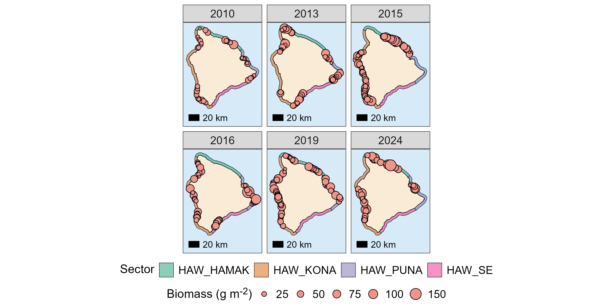
```

```{r}
#| echo: false
#| label: fig-haw-frf
#| fig-cap: "Hawaiʻi Island fish plots. Mean values ± standard error are plotted for biomass, mean size, and biomass per size class of all fishes observed (top); and biomass per consumer group (middle), parrotfish size classes (bottom left), and species of interest (bottom right). The Hawai`i regional mean estimates of each metric are plotted for reference (horizontal gray line). ALT: All fish biomass, mean size, consumer group biomass, parrotfish and families of interest biomass bar graphs"

```



### Hawaiʻi's Hamakua Sector, indicated by green (@fig-haw-map). {.unnumbered}

```{r}
#| echo: false
#| label: fig-haw-ham
#| fig-cap: "Hawaiʻi Island sector fish plots. Mean values ± standard error are plotted for biomass, mean size, and biomass per size class of all fishes observed (top); and biomass per consumer group (middle), parrotfish size classes (bottom left), and families of interest (bottom right)."
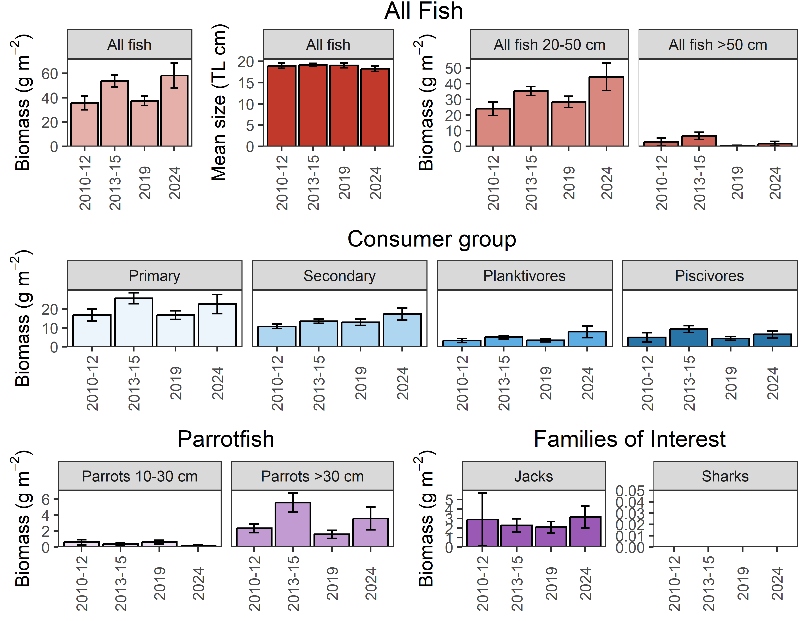
```



### Hawaiʻi's Kona Sector, indicated by orange (@fig-haw-map).{.unnumbered}

```{r}
#| echo: false
#| label: fig-haw-kon
#| fig-cap: "Hawaiʻi Island sector fish plots. Mean values ± standard error are plotted for biomass, mean size, and biomass per size class of all fishes observed (top); and biomass per consumer group (middle), parrotfish size classes (bottom left), and families of interest (bottom right)."

```



### Hawaiʻi's Puna Sector, indicated by purple (@fig-haw-map).{.unnumbered}

```{r}
#| echo: false
#| label: fig-haw-pun
#| fig-cap: "Hawaiʻi Island sector fish plots. Mean values ± standard error are plotted for biomass, mean size, and biomass per size class of all fishes observed (top); and biomass per consumer group (middle), parrotfish size classes (bottom left), and families of interest (bottom right)."
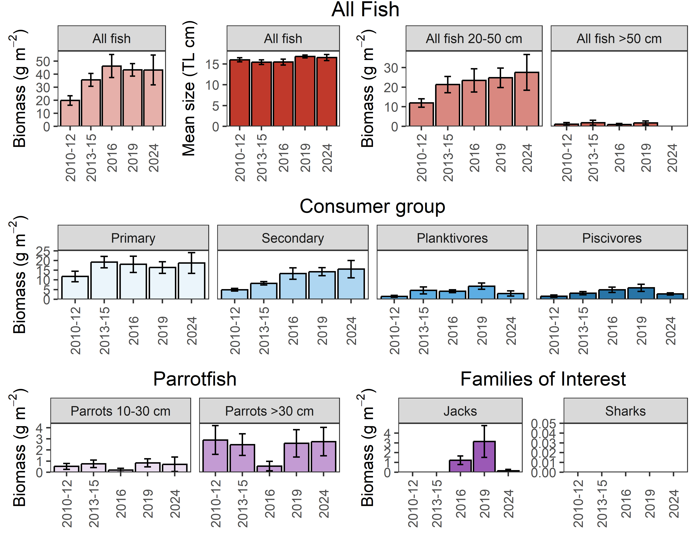
```



### Hawaiʻi's Southeast Sector, indicated by pink (@fig-haw-map).{.unnumbered}

```{r}
#| echo: false
#| label: fig-haw-se
#| fig-cap: "Hawaiʻi Island sector fish plots. Mean values ± standard error are plotted for biomass, mean size, and biomass per size class of all fishes observed (top); and biomass per consumer group (middle), parrotfish size classes (bottom left), and families of interest (bottom right)."
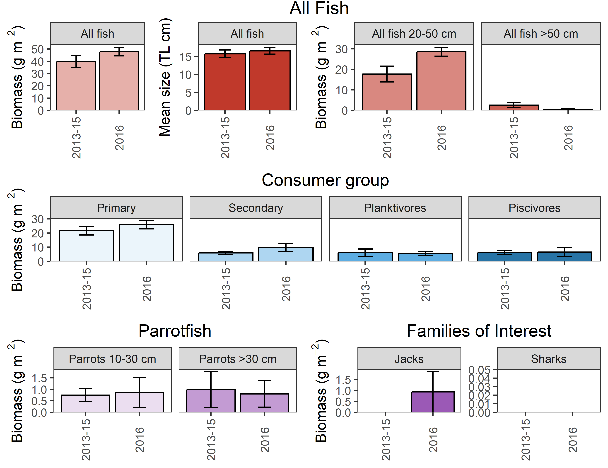
```



## Kauai {.unnumbered}

```{r}
#| echo: false
#| message: false
#| warning: false
#| label: tbl-kai
#| tbl-cap: Year surveyed and the number of sites.

# Load the library we'll need
library(knitr)

# read in island data - number of surveys per year
library(dplyr)
load("data/Data Outputs/working_site_data.rdata")
# filter for after 2009
wsd<-wsd %>% filter(OBS_YEAR>2009)
# make a table of number of survey sites per year
site<-wsd %>% group_by(REGION, OBS_YEAR, ISLAND,METHOD) %>% 
  count()
haw<-as.data.frame(site) %>% filter(ISLAND == "Kauai") %>% dplyr::select(-c(REGION,ISLAND,METHOD))%>% dplyr::rename(Year = OBS_YEAR, Sites = n)
t_haw<-as.data.frame(t(haw))
# Make the table, including:
# renaming the columns (cols_label)
# aligning the text in keeping with the PIFSC template

kable(t_haw,
      col.names=colnames(t_haw),
      align = "rr")
# kable(haw,
#       col.names = c('Year', 'Sites'),
#       align = "rr")

```

Kauai is further broken down into geographic sectors due to its large size. Sectors are indicated by different colors on the map and summary data are shown at the island level and the sector level. 

```{r}
#| echo: false
#| label: fig-kau-map
#| fig-cap: "Kauai Island site survey data by year. Each bubble represents a survey site, and the size of the bubble corresponds to the total fish biomass at each site."
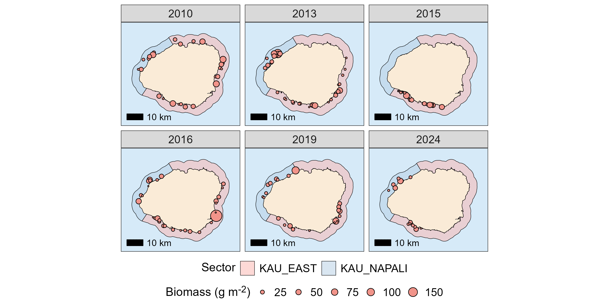
```

```{r}
#| echo: false
#| label: fig-kau-frf
#| fig-cap: "Kauai Island fish plots. Mean values ± standard error are plotted for biomass, mean size, and biomass per size class of all fishes observed (top); and biomass per consumer group (middle), parrotfish size classes (bottom left), and families of interest (bottom right). The Hawai`i regional mean estimates of each metric are plotted for reference (horizontal gray line)."
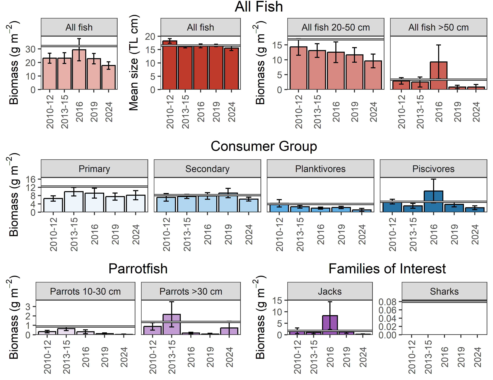
```



### Kauai's east sector, indicated by pink (@fig-kau-map). {.unnumbered}

```{r}
#| echo: false
#| label: fig-kau-east
#| fig-cap: "Kauai Island sector fish plots. Mean values ± standard error are plotted for biomass, mean size, and biomass per size class of all fishes observed (top); and biomass per consumer group (middle), parrotfish size classes (bottom left), and families of interest (bottom right)."
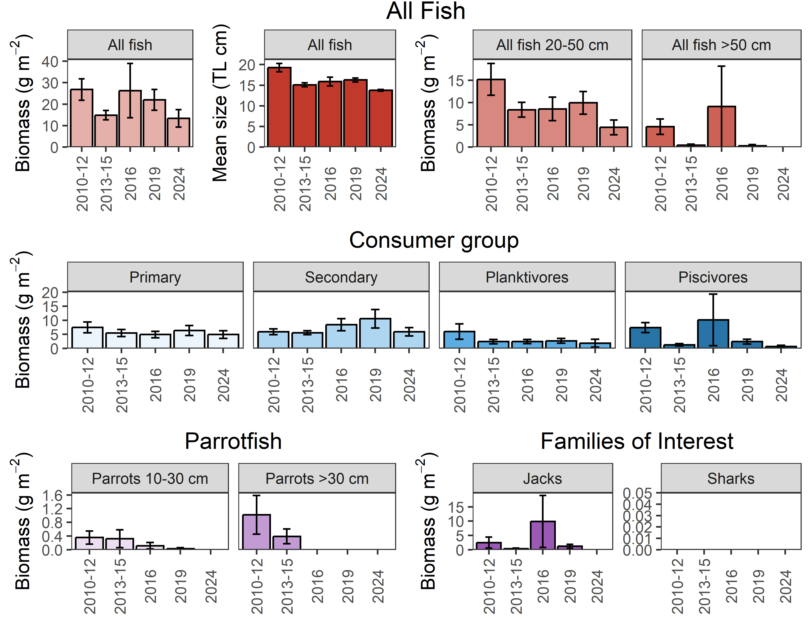
```



### Kauai's napali sector, indicated by blue (@fig-kau-map). {.unnumbered}

```{r}
#| echo: false
#| label: fig-kau-nap
#| fig-cap: "Kauai Island sector fish plots. Mean values ± standard error are plotted for biomass, mean size, and biomass per size class of all fishes observed (top); and biomass per consumer group (middle), parrotfish size classes (bottom left), and families of interest (bottom right)."
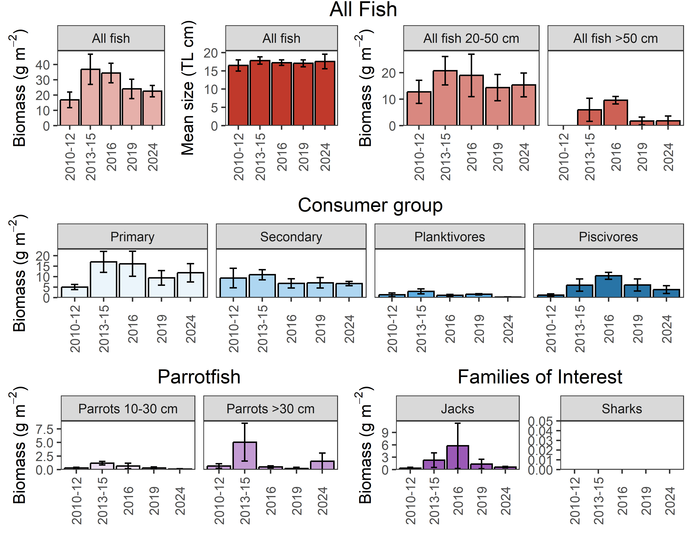
```



## Kahoʻolawe {.unnumbered}

```{r}
#| echo: false
#| message: false
#| warning: false
#| label: tbl-kah
#| tbl-cap: Year surveyed and the number of sites.

# Load the library we'll need
library(knitr)

# read in island data - number of surveys per year
library(dplyr)
load("data/Data Outputs/working_site_data.rdata")

# make a table of number of survey sites per year
site<-wsd %>% group_by(REGION, OBS_YEAR, ISLAND,METHOD) %>% 
  count()
haw<-as.data.frame(site) %>% filter(ISLAND == "Kahoolawe") %>% dplyr::select(-c(REGION,ISLAND,METHOD))%>% dplyr::rename(Year = OBS_YEAR, Sites = n)
t_haw<-as.data.frame(t(haw))
# Make the table, including:
# renaming the columns (cols_label)
# aligning the text in keeping with the PIFSC template

kable(t_haw,
      col.names=colnames(t_haw),
      align = "rr")
# kable(haw,
#       col.names = c('Year', 'Sites'),
#       align = "rr")

```

Kahoʻolawe is further broken down into geographic sectors due to its large size. Sectors are indicated by different colors on the map and summary data are shown at the island level and the sector level. 

```{r}
#| echo: false
#| label: fig-kah-map
#| fig-cap: "Kahoʻolawe Island site survey data by year. Each bubble represents a survey site and the size of the bubble corresponds to the total fish biomass at each site."
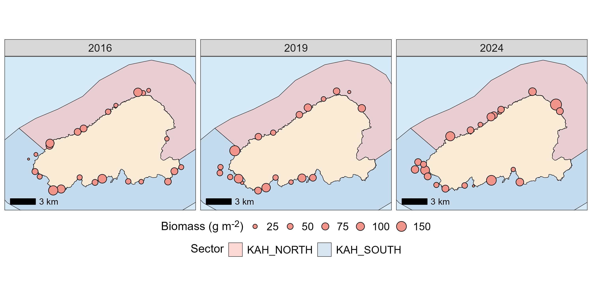
```

```{r}
#| echo: false
#| label: fig-kah-frf
#| fig-cap: "Kahoʻolawe Island fish plots. Mean values ± standard error are plotted for biomass, mean size, and biomass per size class of all fishes observed (top); and biomass per consumer group (middle), parrotfish size classes (bottom left), and families of interest (bottom right). The Hawai`i regional mean estimates of each metric are plotted for reference (horizontal gray line)."
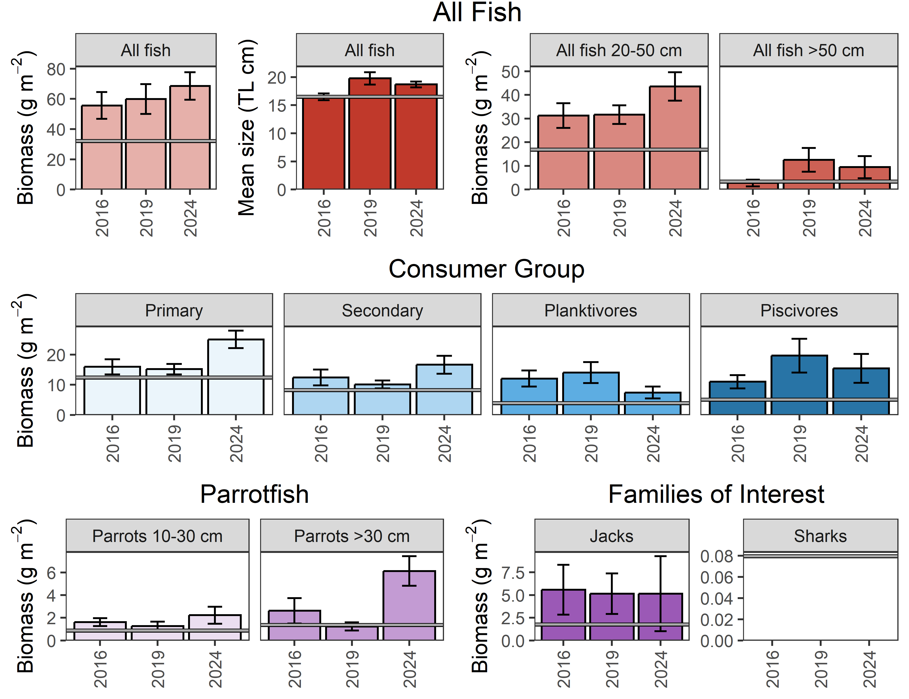
```



### Kahoʻolawe's north sector, indicated by pink (@fig-kah-map). {.unnumbered}

```{r}
#| echo: false
#| label: fig-kah-north
#| fig-cap: "Kahoʻolawe Island sector fish plots. Mean values ± standard error are plotted for biomass, mean size, and biomass per size class of all fishes observed (top); and biomass per consumer group (middle), parrotfish size classes (bottom left), and families of interest (bottom right)."
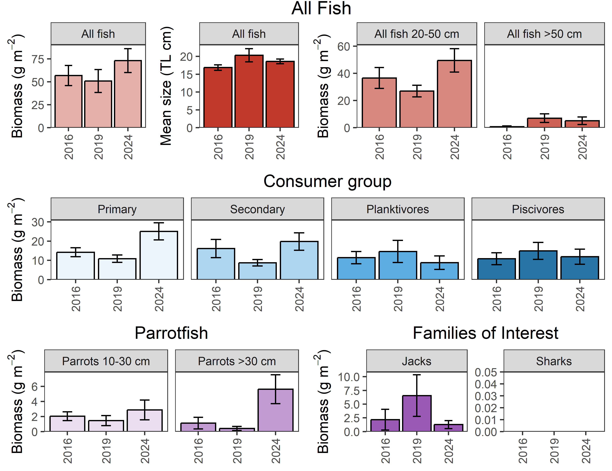
```



### Kahoʻolawe's south sector, indicated by blue (@fig-lan-map). {.unnumbered}

```{r}
#| echo: false
#| label: fig-kah-sou
#| fig-cap: "Kahoʻolawe Island sector fish plots. Mean values ± standard error are plotted for biomass, mean size, and biomass per size class of all fishes observed (top); and biomass per consumer group (middle), parrotfish size classes (bottom left), and families of interest (bottom right)."
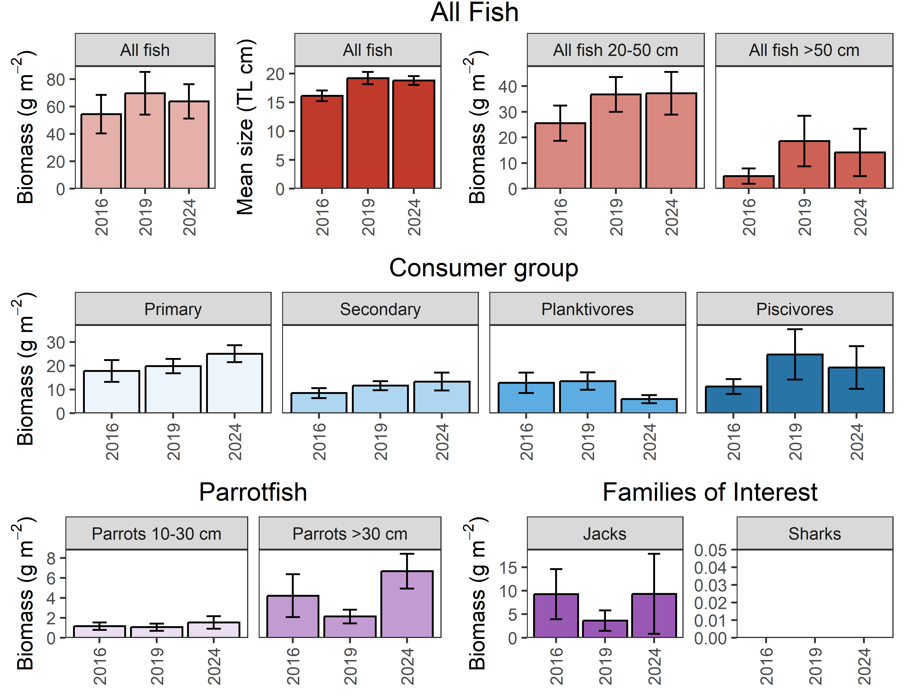
```



## Lanaʻi {.unnumbered}

table caption: Year surveyed and the number of sites.
```{r}
#| echo: false
#| message: false
#| warning: false
#| label: tbl-lan

# Load the library we'll need
library(knitr)

# read in island data - number of surveys per year
library(dplyr)
load("data/Data Outputs/working_site_data.rdata")
# filter for after 2009
wsd<-wsd %>% filter(OBS_YEAR>2009)
# make a table of number of survey sites per year
site<-wsd %>% group_by(REGION, OBS_YEAR, ISLAND,METHOD) %>% 
  count()
haw<-as.data.frame(site) %>% filter(ISLAND == "Lanai") %>% dplyr::select(-c(REGION,ISLAND,METHOD))%>% dplyr::rename(Year = OBS_YEAR, Sites = n)
t_haw<-as.data.frame(t(haw))
# Make the table, including:
# renaming the columns (cols_label)
# aligning the text in keeping with the PIFSC template

kable(t_haw,
      col.names=colnames(t_haw),
      align = "rr")
# kable(haw,
#       col.names = c('Year', 'Sites'),
#       align = "rr")

```

Lanaʻi is further broken down into geographic sectors due to its large size. Sectors are indicated by different colors on the map and summary data are shown at the island level and the sector level. 

```{r}
#| echo: false
#| label: fig-lan-map
#| fig-cap: "Lanaʻi Island site survey data by year. Each bubble represents a survey site and the size of the bubble corresponds to the total fish biomass at each site."
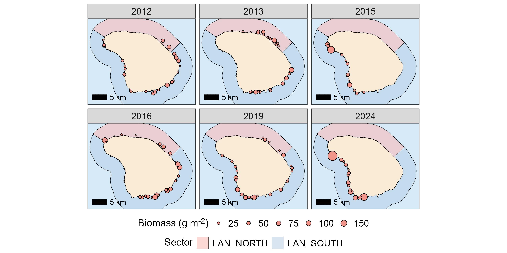
```

```{r}
#| echo: false
#| label: fig-lan-frf
#| fig-cap: "Lanaʻi Island fish plots. Mean values ± standard error are plotted for biomass, mean size, and biomass per size class of all fishes observed (top); and biomass per consumer group (middle), parrotfish size classes (bottom left), and families of interest (bottom right). The Hawai`i regional mean estimates of each metric are plotted for reference (horizontal gray line)."
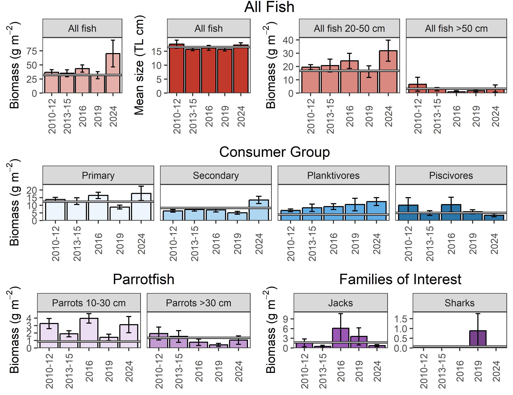
```



### Lanaʻi's north sector, indicated by pink (@fig-lan-map). {.unnumbered}

```{r}
#| echo: false
#| label: fig-lan-north
#| fig-cap: "Lanaʻi Island sector fish plots. Mean values ± standard error are plotted for biomass, mean size, and biomass per size class of all fishes observed (top); and biomass per consumer group (middle), parrotfish size classes (bottom left), and families of interest (bottom right)."
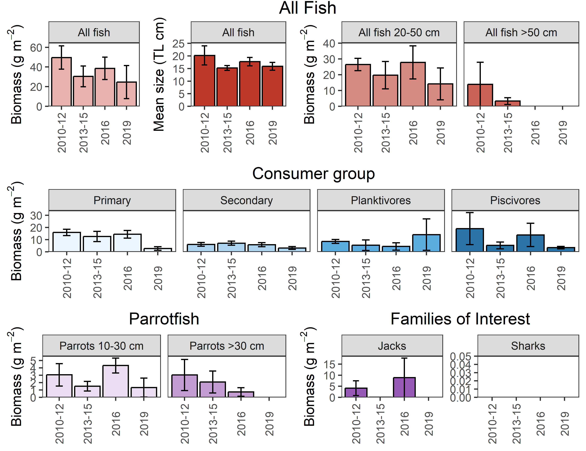
```



### Lanaʻi's south sector, indicated by blue (@fig-lan-map). {.unnumbered}

```{r}
#| echo: false
#| label: fig-lan-sou
#| fig-cap: "Lanaʻi Island sector fish plots. Mean values ± standard error are plotted for biomass, mean size, and biomass per size class of all fishes observed (top); and biomass per consumer group (middle), parrotfish size classes (bottom left), and families of interest (bottom right)."
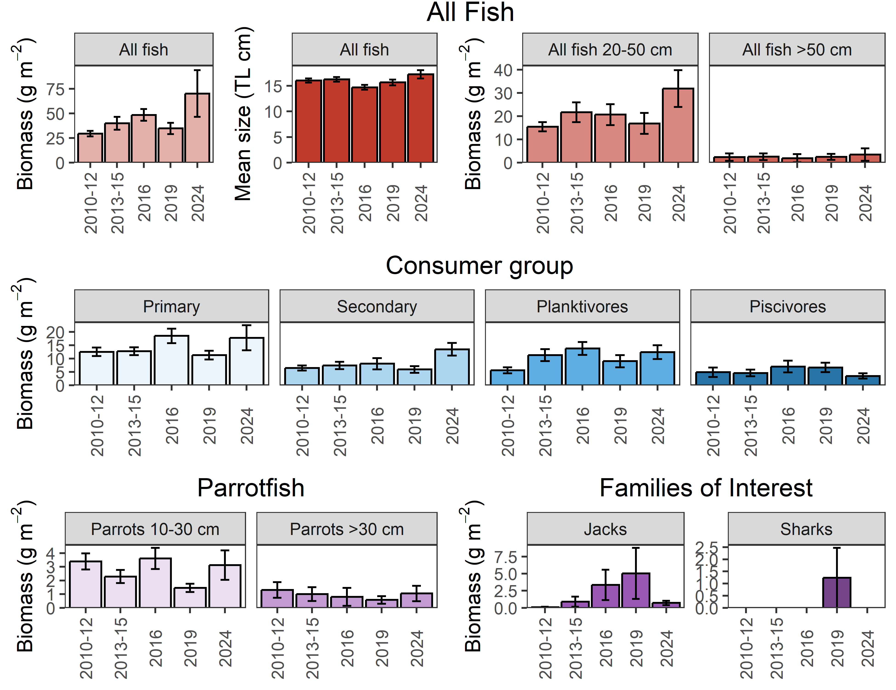
```



## Maui {.unnumbered}

table caption: Year surveyed and the number of sites.

```{r}
#| echo: false
#| message: false
#| warning: false
#| label: tbl-mai

# Load the library we'll need
library(knitr)

# read in island data - number of surveys per year
library(dplyr)
load("data/Data Outputs/working_site_data.rdata")
# filter for after 2009
wsd<-wsd %>% filter(OBS_YEAR>2009)
# make a table of number of survey sites per year
site<-wsd %>% group_by(REGION, OBS_YEAR, ISLAND,METHOD) %>% 
  count()
haw<-as.data.frame(site) %>% filter(ISLAND == "Maui") %>% dplyr::select(-c(REGION,ISLAND,METHOD))%>% dplyr::rename(Year = OBS_YEAR, Sites = n)
t_haw<-as.data.frame(t(haw))
# Make the table, including:
# renaming the columns (cols_label)
# aligning the text in keeping with the PIFSC template

kable(t_haw,
      col.names=colnames(t_haw),
      align = "rr")
# kable(haw,
#       col.names = c('Year', 'Sites'),
#       align = "rr")

```

Maui is further broken down into geographic sectors due to its large size. Sectors are indicated by different colors on the map and summary data are shown at the island level and the sector level. 

```{r}
#| echo: false
#| label: fig-mai-map
#| fig-cap: "Maui Island site survey data by year. Each bubble represents a survey site and the size of the bubble corresponds to the total fish biomass at each site."
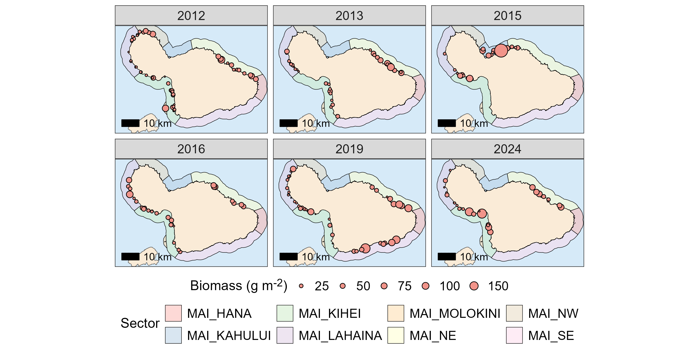
```

```{r}
#| echo: false
#| label: fig-mai-frf
#| fig-cap: "Maui Island fish plots. Mean values ± standard error are plotted for biomass, mean size, and biomass per size class of all fishes observed (top); and biomass per consumer group (middle), parrotfish size classes (bottom left), and families of interest (bottom right). The Hawai`i regional mean estimates of each metric are plotted for reference (horizontal gray line)."
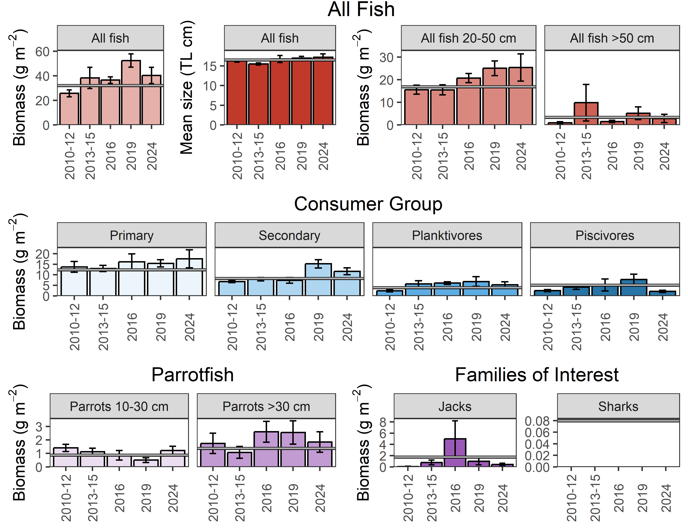
```



### Maui's hana sector, indicated by pink (@fig-mai-map). {.unnumbered}

```{r}
#| echo: false
#| label: fig-mai-hana
#| fig-cap: "Maui Island sector fish plots. Mean values ± standard error are plotted for biomass, mean size, and biomass per size class of all fishes observed (top); and biomass per consumer group (middle), parrotfish size classes (bottom left), and families of interest (bottom right)."
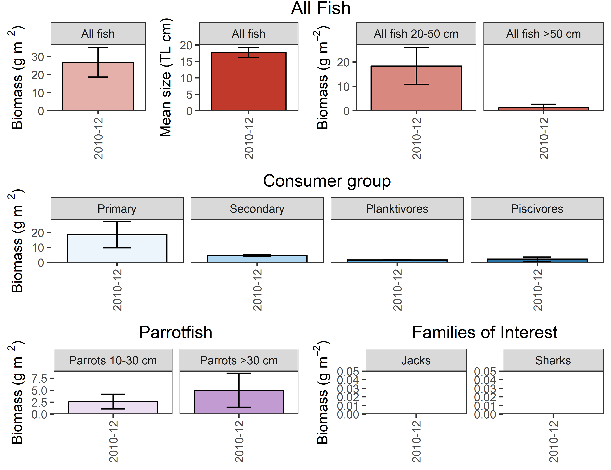
```



### Maui's Kahului sector, indicated by blue (@fig-mai-map). {.unnumbered}

```{r}
#| echo: false
#| label: fig-mai-kah
#| fig-cap: "Maui Island sector fish plots. Mean values ± standard error are plotted for biomass, mean size, and biomass per size class of all fishes observed (top); and biomass per consumer group (middle), parrotfish size classes (bottom left), and families of interest (bottom right)."
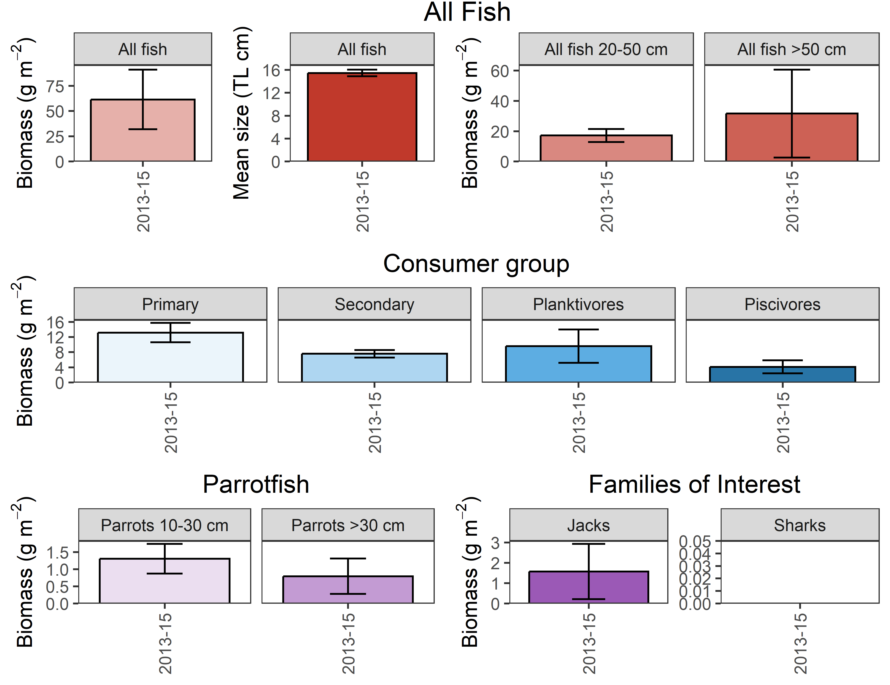
```



### Maui's Kihei sector, indicated by green (@fig-mai-map). {.unnumbered}

```{r}
#| echo: false
#| label: fig-mai-kih
#| fig-cap: "Maui Island sector fish plots. Mean values ± standard error are plotted for biomass, mean size, and biomass per size class of all fishes observed (top); and biomass per consumer group (middle), parrotfish size classes (bottom left), and families of interest (bottom right)."
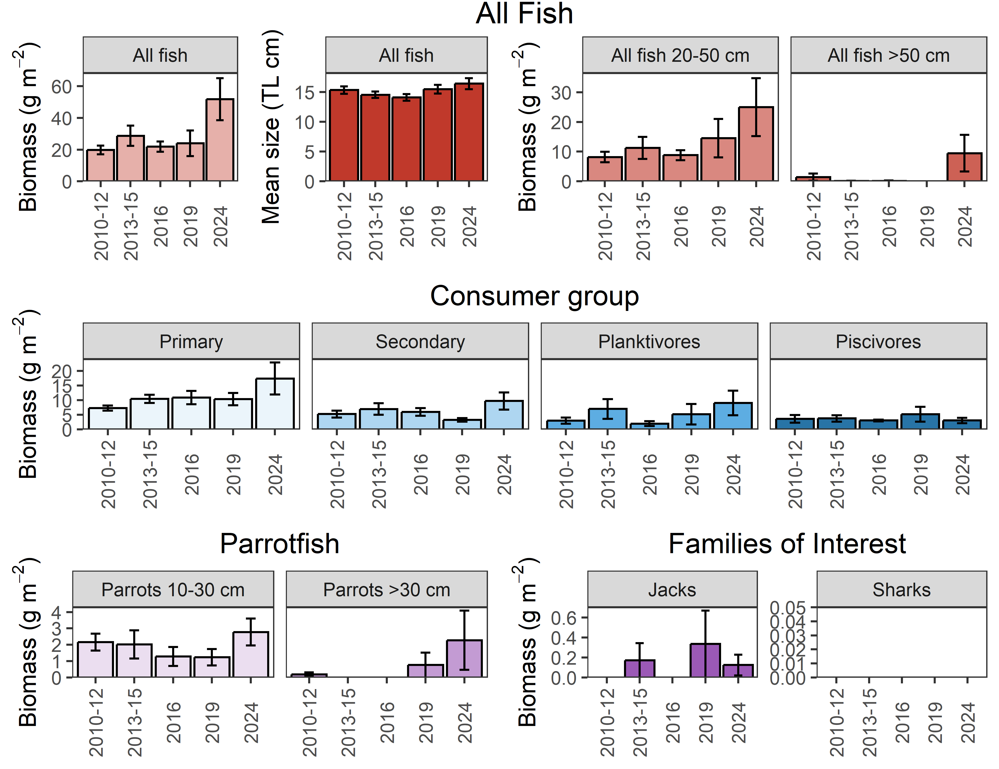
```



### Maui's Lahaina sector, indicated by purple (@fig-mai-map). {.unnumbered}

```{r}
#| echo: false
#| label: fig-mai-lah
#| fig-cap: "Maui Island sector fish plots. Mean values ± standard error are plotted for biomass, mean size, and biomass per size class of all fishes observed (top); and biomass per consumer group (middle), parrotfish size classes (bottom left), and families of interest (bottom right)."
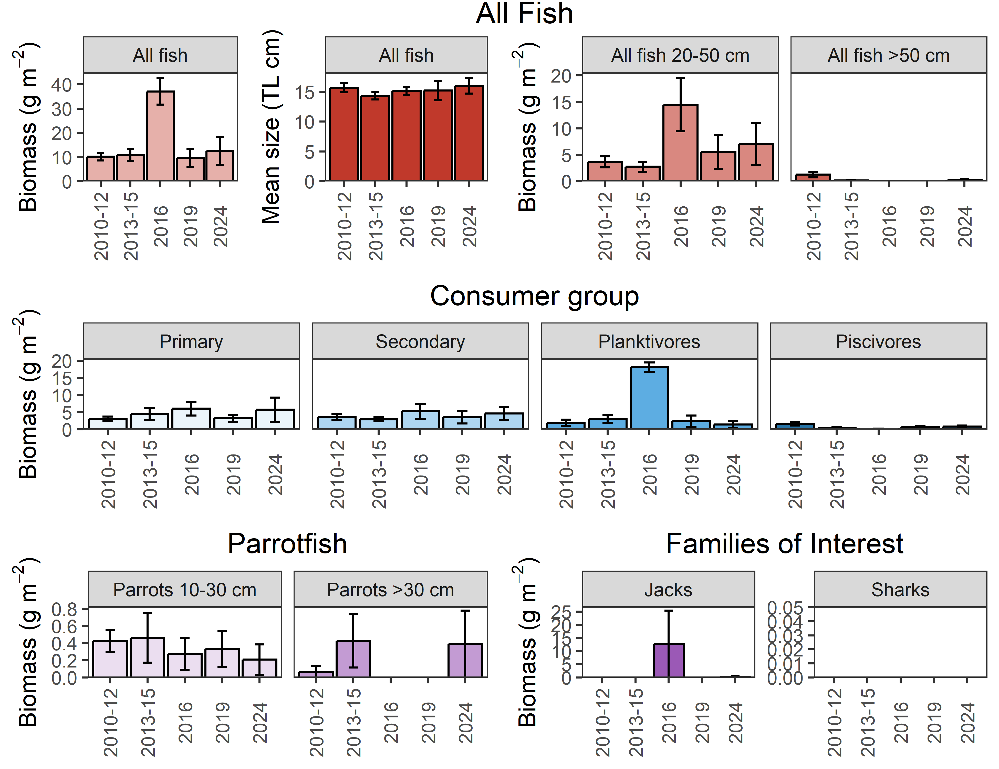
```



### Maui's northeast sector, indicated by olive (@fig-mai-map). {.unnumbered}

```{r}
#| echo: false
#| label: fig-mai-ne
#| fig-cap: "Maui Island sector fish plots. Mean values ± standard error are plotted for biomass, mean size, and biomass per size class of all fishes observed (top); and biomass per consumer group (middle), parrotfish size classes (bottom left), and families of interest (bottom right)."

```



## Molokaʻi {.unnumbered}

table caption: Year surveyed and the number of sites.

```{r}
#| echo: false
#| message: false
#| warning: false
#| label: tbl-mol

# Load the library we'll need
library(knitr)

# read in island data - number of surveys per year
library(dplyr)
load("data/Data Outputs/working_site_data.rdata")
# filter for after 2009
wsd<-wsd %>% filter(OBS_YEAR>2009)
# make a table of number of survey sites per year
site<-wsd %>% group_by(REGION, OBS_YEAR, ISLAND,METHOD) %>% 
  count()
haw<-as.data.frame(site) %>% filter(ISLAND == "Molokai") %>% dplyr::select(-c(REGION,ISLAND,METHOD))%>% dplyr::rename(Year = OBS_YEAR, Sites = n)
t_haw<-as.data.frame(t(haw))
# Make the table, including:
# renaming the columns (cols_label)
# aligning the text in keeping with the PIFSC template

kable(t_haw,
      col.names=colnames(t_haw),
      align = "rr")
# kable(haw,
#       col.names = c('Year', 'Sites'),
#       align = "rr")

```

Molokaʻi is further broken down into geographic sectors due to its large size. Sectors are indicated by different colors on the map and summary data are shown at the island level and the sector level. 

```{r}
#| echo: false
#| label: fig-mol-map
#| fig-cap: "Molokaʻi Island site survey data by year. Each bubble represents a survey site and the size of the bubble corresponds to the total fish biomass at each site."
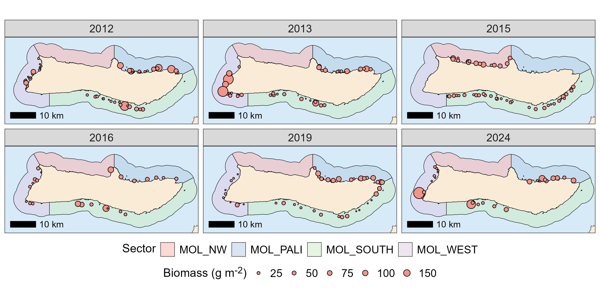
```

```{r}
#| echo: false
#| label: fig-mol-frf
#| fig-cap: "Molokaʻi Island fish plots. Mean values ± standard error are plotted for biomass, mean size, and biomass per size class of all fishes observed (top); and biomass per consumer group (middle), parrotfish size classes (bottom left), and families of interest (bottom right). The Hawai`i regional mean estimates of each metric are plotted for reference (horizontal gray line)."
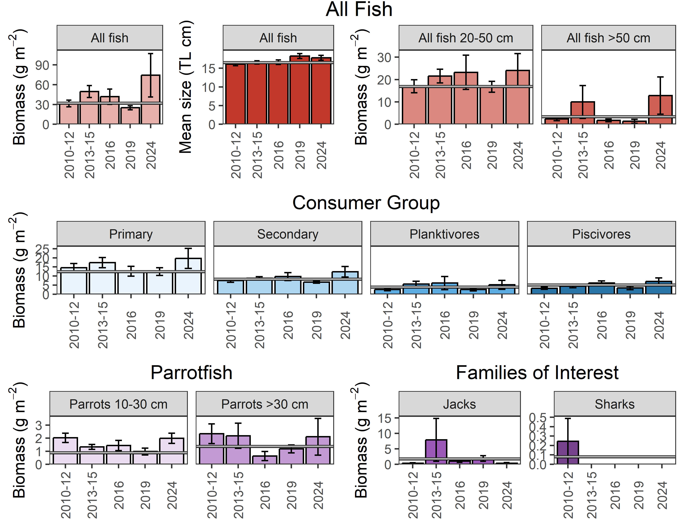
```



### Molokaʻi's northwest sector, indicated by pink (@fig-mol-map). {.unnumbered}

```{r}
#| echo: false
#| label: fig-mol-nw
#| fig-cap: "Molokaʻi Island sector fish plots. Mean values ± standard error are plotted for biomass, mean size, and biomass per size class of all fishes observed (top); and biomass per consumer group (middle), parrotfish size classes (bottom left), and families of interest (bottom right)."
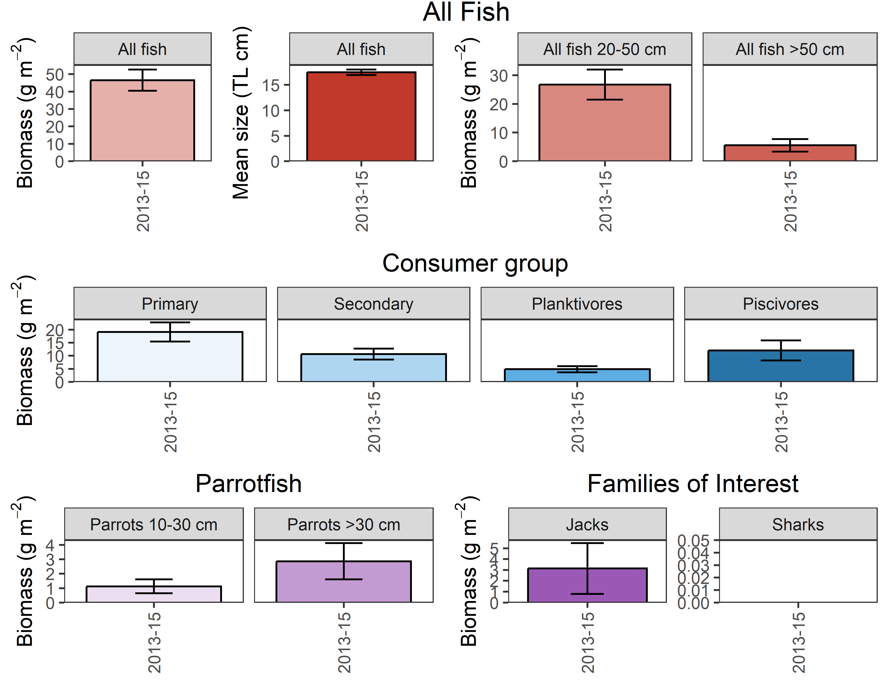
```



### Molokaʻi's pali sector, indicated by blue (@fig-mol-map). {.unnumbered}

```{r}
#| echo: false
#| label: fig-mol-pal
#| fig-cap: "Molokaʻi Island sector fish plots. Mean values ± standard error are plotted for biomass, mean size, and biomass per size class of all fishes observed (top); and biomass per consumer group (middle), parrotfish size classes (bottom left), and families of interest (bottom right)."
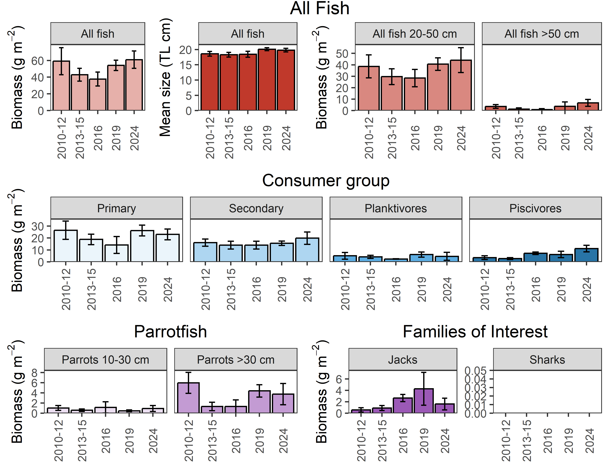
```



### Molokaʻi's south sector, indicated by green (@fig-mol-map). {.unnumbered}

```{r}
#| echo: false
#| label: fig-mol-sou
#| fig-cap: "Molokaʻi Island sector fish plots. Mean values ± standard error are plotted for biomass, mean size, and biomass per size class of all fishes observed (top); and biomass per consumer group (middle), parrotfish size classes (bottom left), and families of interest (bottom right)."
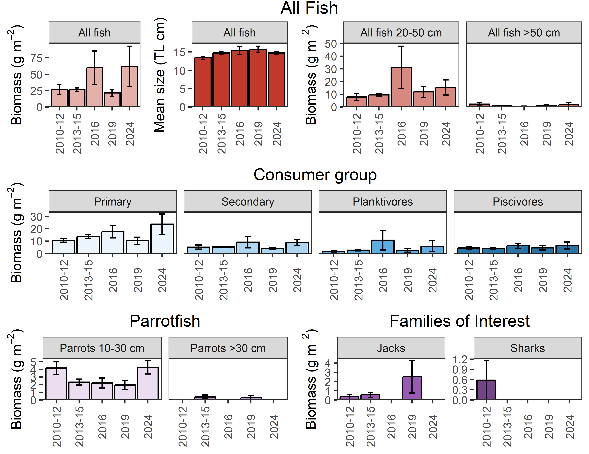
```



### Molokaʻi's west sector, indicated by purple (@fig-mol-map). {.unnumbered}

```{r}
#| echo: false
#| label: fig-mol-wes
#| fig-cap: "Molokaʻi Island sector fish plots. Mean values ± standard error are plotted for biomass, mean size, and biomass per size class of all fishes observed (top); and biomass per consumer group (middle), parrotfish size classes (bottom left), and families of interest (bottom right)."
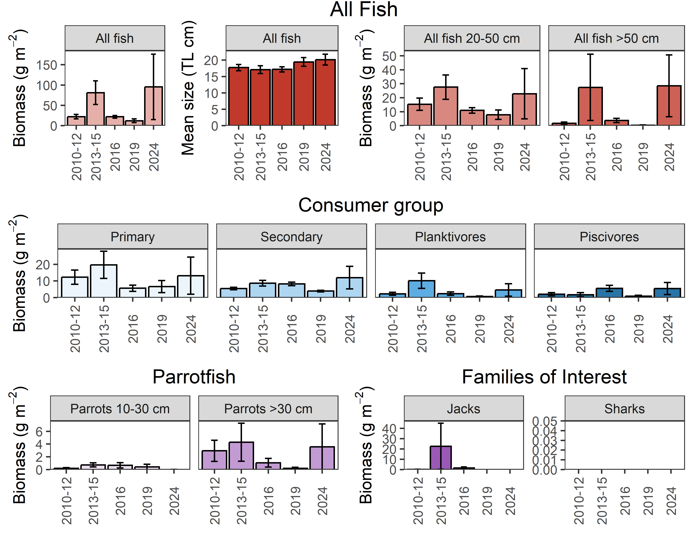
```



## Niʻihau {.unnumbered}

table caption: Year surveyed and the number of sites.

```{r}
#| echo: false
#| message: false
#| warning: false
#| label: tbl-nii

# Load the library we'll need
library(knitr)

# read in island data - number of surveys per year
library(dplyr)
load("data/Data Outputs/working_site_data.rdata")
# filter for after 2009
wsd<-wsd %>% filter(OBS_YEAR>2009)
# make a table of number of survey sites per year
site<-wsd %>% group_by(REGION, OBS_YEAR, ISLAND,METHOD) %>% 
  count()
haw<-as.data.frame(site) %>% filter(ISLAND == "Niihau") %>% dplyr::select(-c(REGION,ISLAND,METHOD))%>% dplyr::rename(Year = OBS_YEAR, Sites = n)
t_haw<-as.data.frame(t(haw))
# Make the table, including:
# renaming the columns (cols_label)
# aligning the text in keeping with the PIFSC template

kable(t_haw,
      col.names=colnames(t_haw),
      align = "rr")
# kable(haw,
#       col.names = c('Year', 'Sites'),
#       align = "rr")

```

Niʻihau is further broken down into geographic sectors due to its large size. Sectors are indicated by different colors on the map and summary data are shown at the island level and the sector level. 

```{r}
#| echo: false
#| label: fig-nii-map
#| fig-cap: "Niʻihau Island site survey data by year. Each bubble represents a survey site and the size of the bubble corresponds to the total fish biomass at each site."
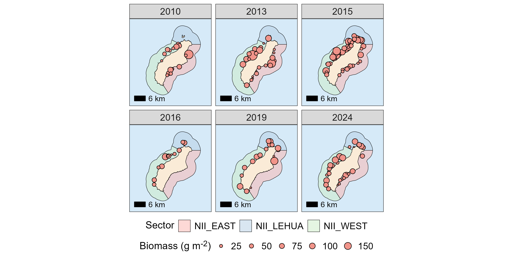
```

```{r}
#| echo: false
#| label: fig-nii-frf
#| fig-cap: "Niʻihau Island fish plots. Mean values ± standard error are plotted for biomass, mean size, and biomass per size class of all fishes observed (top); and biomass per consumer group (middle), parrotfish size classes (bottom left), and families of interest (bottom right). The Hawai`i regional mean estimates of each metric are plotted for reference (horizontal gray line)."
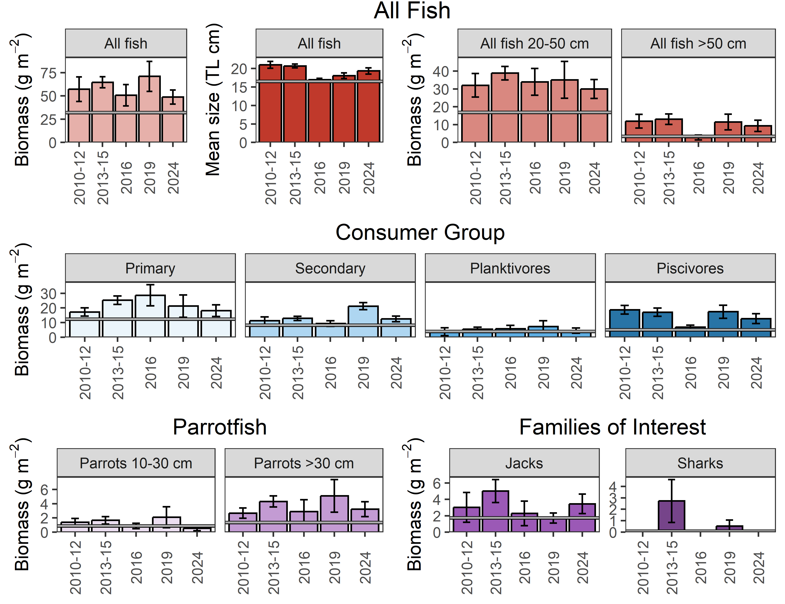
```



### Niʻihau's east sector, indicated by pink (@fig-nii-map). {.unnumbered}

```{r}
#| echo: false
#| label: fig-nii-eas
#| fig-cap: "Niʻihau Island sector fish plots. Mean values ± standard error are plotted for biomass, mean size, and biomass per size class of all fishes observed (top); and biomass per consumer group (middle), parrotfish size classes (bottom left), and families of interest (bottom right)."
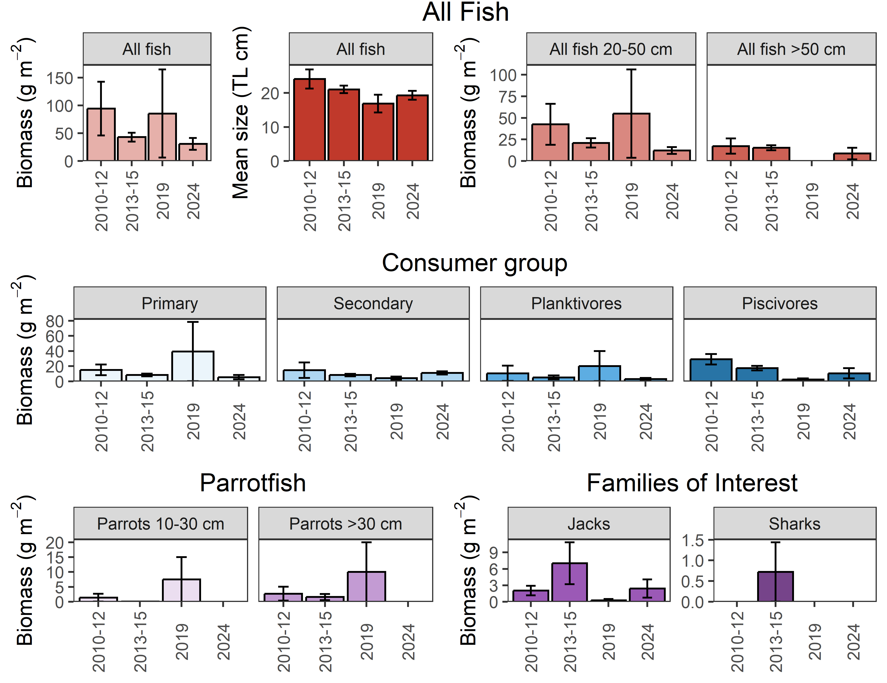
```



### Niʻihau's Lehua sector, indicated by blue (@fig-mol-map). {.unnumbered}

```{r}
#| echo: false
#| label: fig-nii-pal
#| fig-cap: "Niʻihau Island sector fish plots. Mean values ± standard error are plotted for biomass, mean size, and biomass per size class of all fishes observed (top); and biomass per consumer group (middle), parrotfish size classes (bottom left), and families of interest (bottom right)."
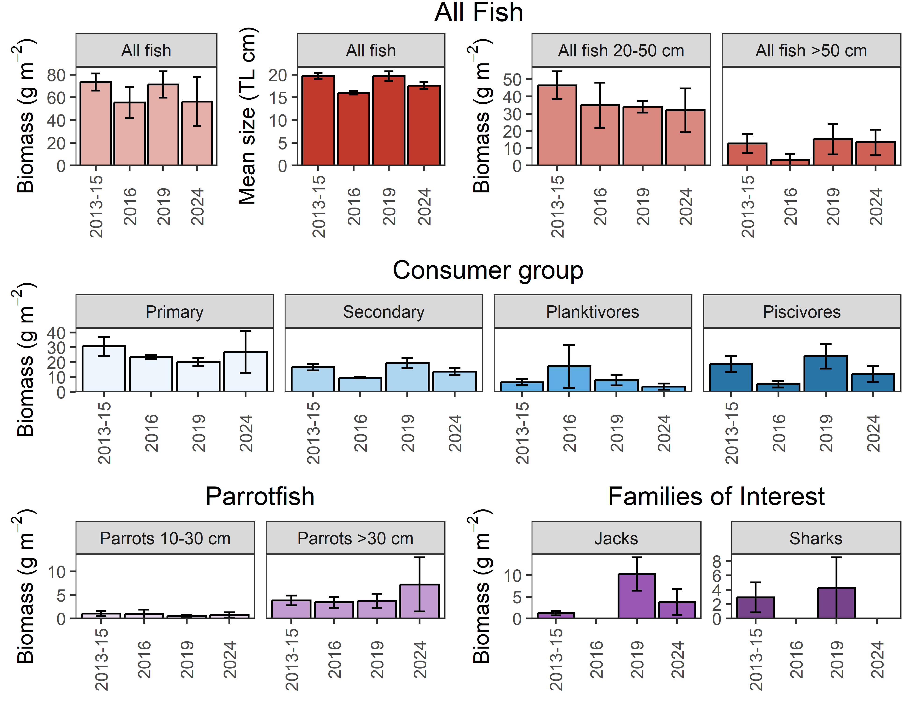
```



### Niʻihau's west sector, indicated by green (@fig-nii-map). {.unnumbered}

```{r}
#| echo: false
#| label: fig-nii-wes
#| fig-cap: "Niʻihau Island sector fish plots. Mean values ± standard error are plotted for biomass, mean size, and biomass per size class of all fishes observed (top); and biomass per consumer group (middle), parrotfish size classes (bottom left), and families of interest (bottom right)."
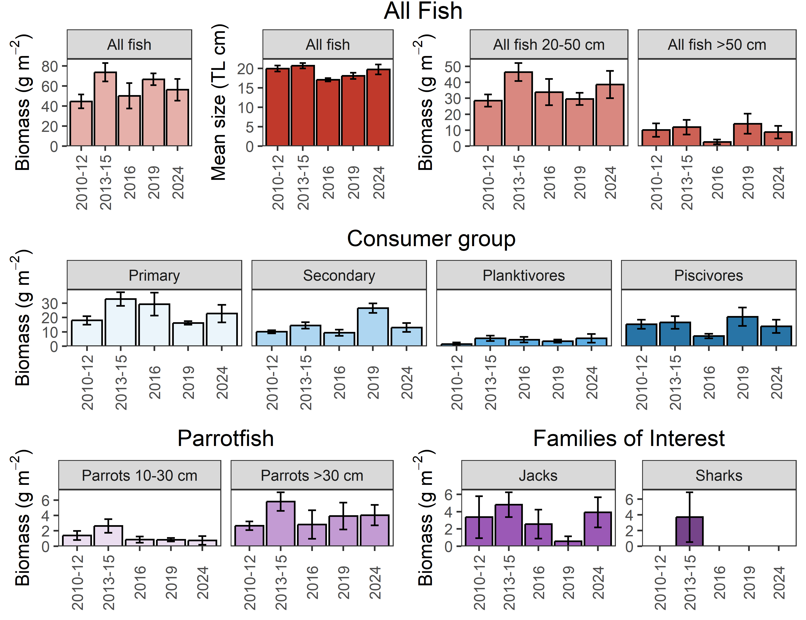
```



## Oʻahu {.unnumbered}

table caption: Year surveyed and the number of sites.

```{r}
#| echo: false
#| message: false
#| warning: false
#| label: tbl-oah

# Load the library we'll need
library(knitr)

# read in island data - number of surveys per year
library(dplyr)
load("data/Data Outputs/working_site_data.rdata")
# filter for after 2009
wsd<-wsd %>% filter(OBS_YEAR>2009)
# make a table of number of survey sites per year
site<-wsd %>% group_by(REGION, OBS_YEAR, ISLAND,METHOD) %>% 
  count()
haw<-as.data.frame(site) %>% filter(ISLAND == "Oahu") %>% dplyr::select(-c(REGION,ISLAND,METHOD))%>% dplyr::rename(Year = OBS_YEAR, Sites = n)
t_haw<-as.data.frame(t(haw))
# Make the table, including:
# renaming the columns (cols_label)
# aligning the text in keeping with the PIFSC template

kable(t_haw,
      col.names=colnames(t_haw),
      align = "rr")
# kable(haw,
#       col.names = c('Year', 'Sites'),
#       align = "rr")

```

Oʻahu is further broken down into geographic sectors due to its large size. Sectors are indicated by different colors on the map and summary data are shown at the island level and the sector level. 

```{r}
#| echo: false
#| label: fig-oah-map
#| fig-cap: "Oʻahu Island site survey data by year. Each bubble represents a survey site and the size of the bubble corresponds to the total fish biomass at each site."
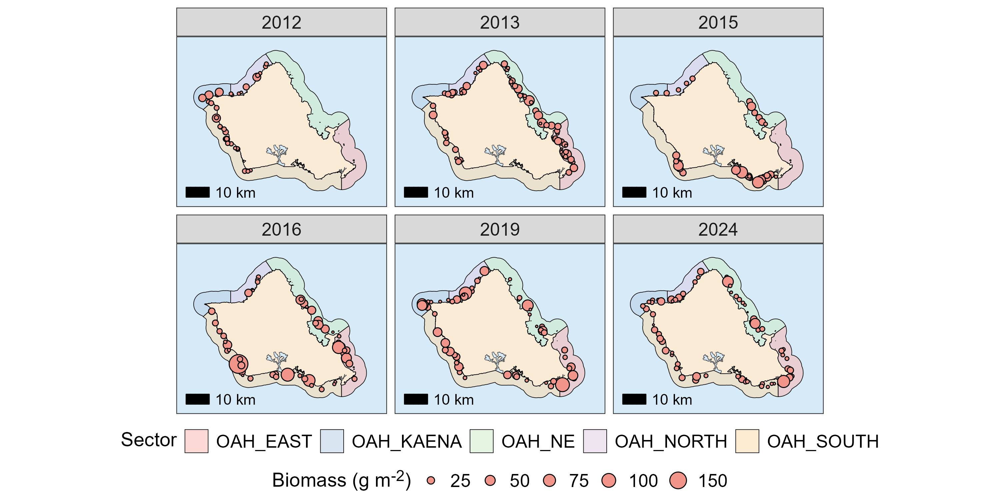
```

```{r}
#| echo: false
#| label: fig-oah-frf
#| fig-cap: "Oʻahu Island fish plots. Mean values ± standard error are plotted for biomass, mean size, and biomass per size class of all fishes observed (top); and biomass per consumer group (middle), parrotfish size classes (bottom left), and families of interest (bottom right). The Hawai`i regional mean estimates of each metric are plotted for reference (horizontal gray line)."
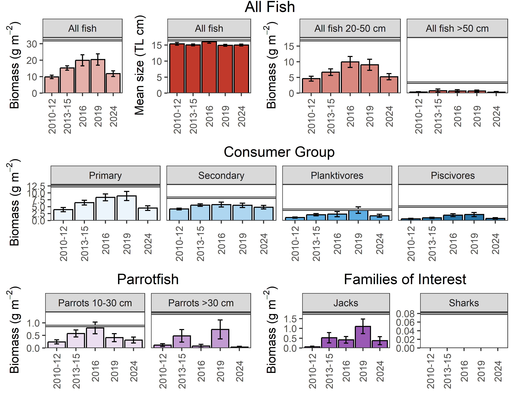
```



### Oʻahu's east sector, indicated by pink (@fig-oah-map). {.unnumbered}

```{r}
#| echo: false
#| label: fig-oah-east
#| fig-cap: "Oʻahu Island sector fish plots. Mean values ± standard error are plotted for biomass, mean size, and biomass per size class of all fishes observed (top); and biomass per consumer group (middle), parrotfish size classes (bottom left), and families of interest (bottom right)."
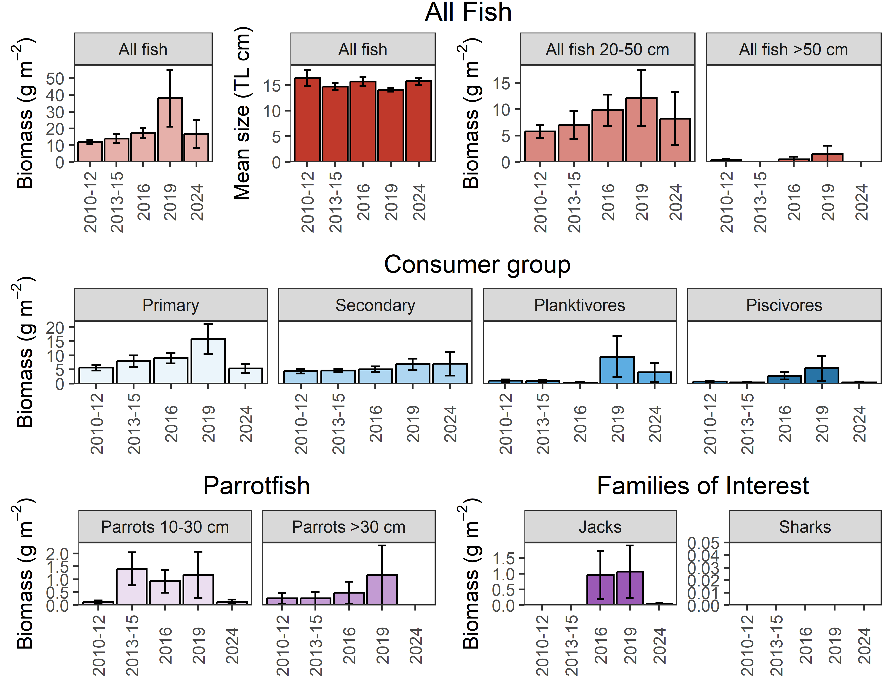
```



### Oʻahu's Kaena sector, indicated by blue (@fig-oah-map). {.unnumbered}

```{r}
#| echo: false
#| label: fig-oah-kae
#| fig-cap: "Oʻahu Island sector fish plots. Mean values ± standard error are plotted for biomass, mean size, and biomass per size class of all fishes observed (top); and biomass per consumer group (middle), parrotfish size classes (bottom left), and families of interest (bottom right)."
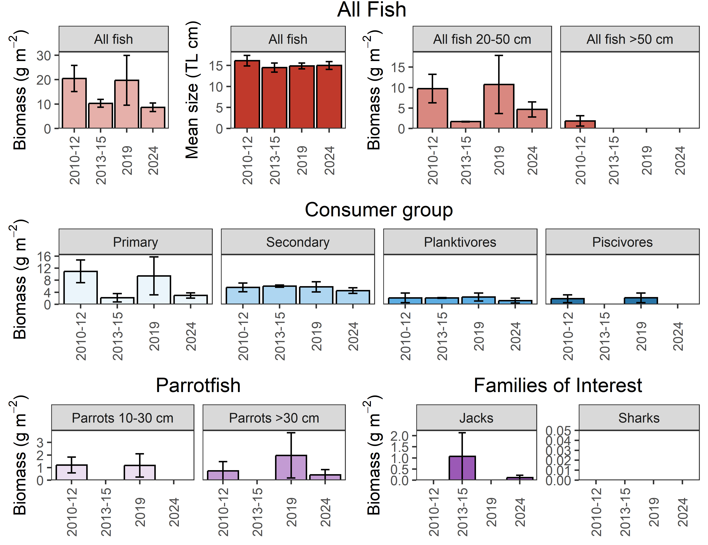
```



### Oʻahu's northeast sector, indicated by green (@fig-oah-map). {.unnumbered}

```{r}
#| echo: false
#| label: fig-oah-ne
#| fig-cap: "Oʻahu Island sector fish plots. Mean values ± standard error are plotted for biomass, mean size, and biomass per size class of all fishes observed (top); and biomass per consumer group (middle), parrotfish size classes (bottom left), and families of interest (bottom right)."
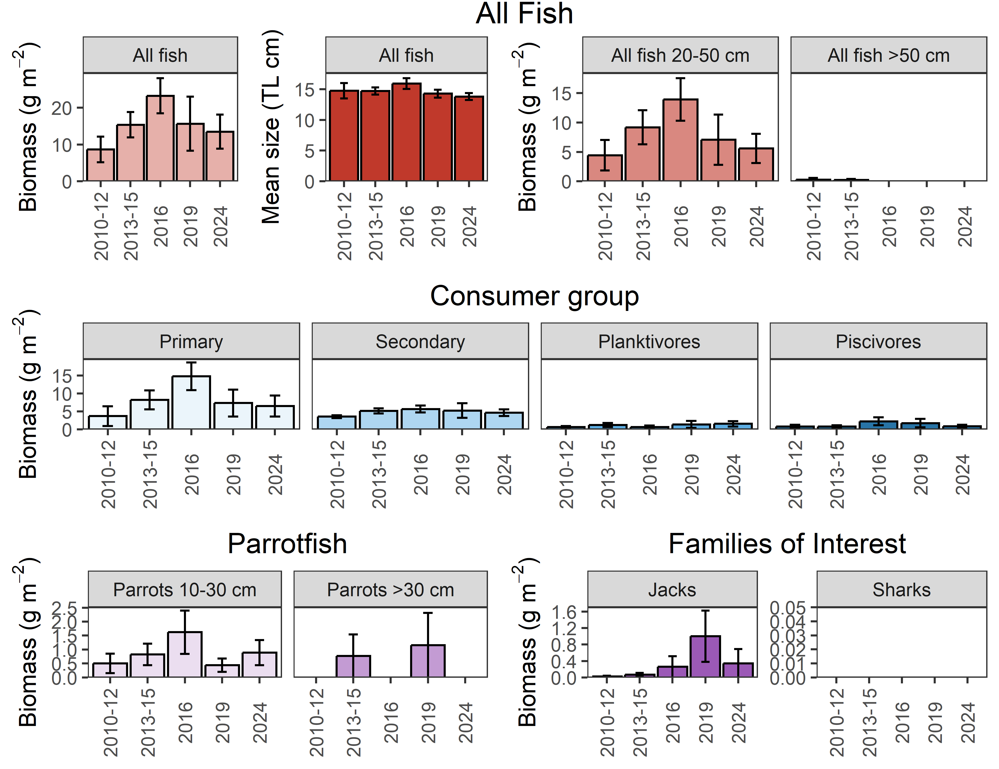
```



### Oʻahu's north sector, indicated by purple (@fig-oah-map). {.unnumbered}

```{r}
#| echo: false
#| label: fig-oah-nor
#| fig-cap: "Oʻahu Island sector fish plots. Mean values ± standard error are plotted for biomass, mean size, and biomass per size class of all fishes observed (top); and biomass per consumer group (middle), parrotfish size classes (bottom left), and families of interest (bottom right)."
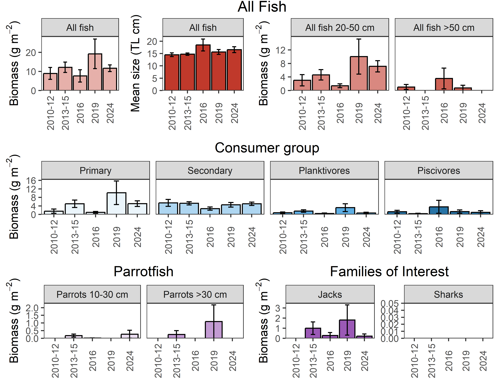
```



### Oʻahu's south sector, indicated by olive (@fig-oah-map). {.unnumbered}

```{r}
#| echo: false
#| label: fig-oah-sou
#| fig-cap: "Oʻahu Island sector fish plots. Mean values ± standard error are plotted for biomass, mean size, and biomass per size class of all fishes observed (top); and biomass per consumer group (middle), parrotfish size classes (bottom left), and families of interest (bottom right)."
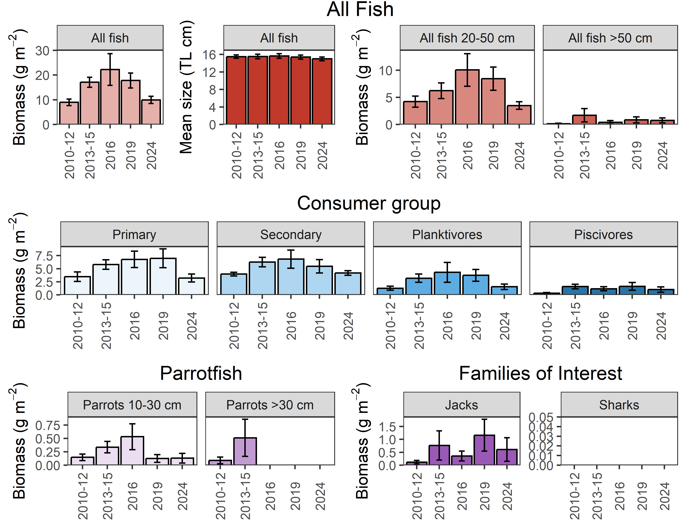
```



# Papahānaumokuākea Marine National Monument {.unnumbered}

## Hōlanikū (Kure)  {.unnumbered}

table caption: Year surveyed and the number of sites.

```{r}
#| echo: false
#| message: false
#| warning: false
#| label: tbl-kur

# Load the library we'll need
library(knitr)

# read in island data - number of surveys per year
library(dplyr)
load("data/Data Outputs/working_site_data.rdata")
# filter for after 2009
wsd<-wsd %>% filter(OBS_YEAR>2009)
# make a table of number of survey sites per year
site<-wsd %>% group_by(REGION, OBS_YEAR, ISLAND,METHOD) %>% 
  count()
haw<-as.data.frame(site) %>% filter(ISLAND == "Kure") %>% dplyr::select(-c(REGION,ISLAND,METHOD))%>% dplyr::rename(Year = OBS_YEAR, Sites = n)
t_haw<-as.data.frame(t(haw))
# Make the table, aligning rr
kable(t_haw,
      align = "rr")
```

```{r}
#| echo: false
#| label: fig-kur-map
#| fig-cap: "Hōlanikū site survey data by year. Each bubble represents a survey site and the size of the bubble corresponds to the total fish biomass at each site."
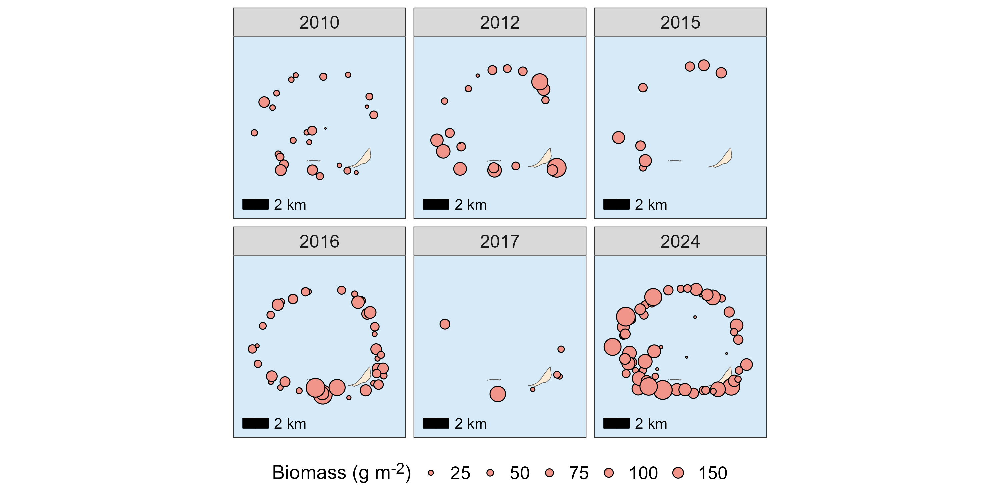
```

Hōlanikū, also known as Kure Atoll, is further broken down into different habitat types or reef zones.  



### Forereef habitat {.unnumbered}

table caption: Year surveyed and the number of sites.

```{r}
#| echo: false
#| message: false
#| warning: false
#| label: tbl-kur-frf

# make a table of number of survey sites per year
site<-wsd %>% group_by(REGION, OBS_YEAR, ISLAND,REEF_ZONE,METHOD) %>% 
  count()
haw<-as.data.frame(site) %>% filter(ISLAND == "Kure"& REEF_ZONE == "Forereef") %>% dplyr::select(-c(REGION,ISLAND,REEF_ZONE,METHOD))%>% dplyr::rename(Year = OBS_YEAR, Sites = n) 
haw<-haw %>% filter(Sites>1)
t_haw<-as.data.frame(t(haw))
# Make the table, including:
# aligning the text in keeping with the PIFSC template
kable(t_haw,
      align = "rr")

```

```{r}
#| echo: false
#| label: fig-kur-frf
#| fig-cap: "Hōlanikū forereef fish plots. Mean values ± standard error are plotted for biomass, mean size, and biomass per size class of all fishes observed (top); and biomass per consumer group (middle), parrotfish size classes (bottom left), and families of interest (bottom right). The Hawai`i regional mean estimates of each metric are plotted for reference (horizontal gray line)."
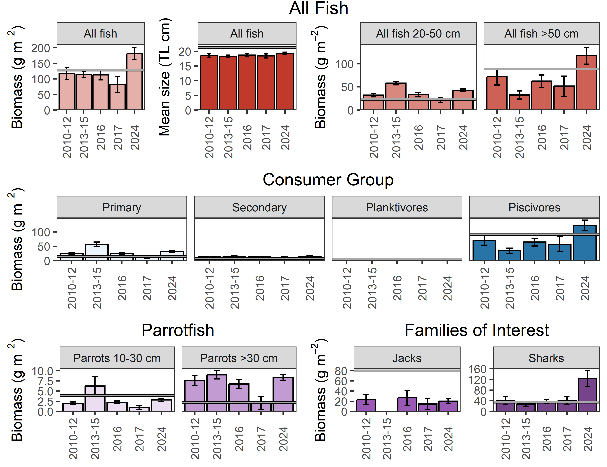
```



### Lagoon habitat {.unnumbered}

table caption: Year surveyed and the number of sites.

```{r}
#| echo: false
#| message: false
#| warning: false
#| label: tbl-kur-lag

# make a table of number of survey sites per year
site<-wsd %>% group_by(REGION, OBS_YEAR, ISLAND,REEF_ZONE,METHOD) %>% 
  count()
haw<-as.data.frame(site) %>% filter(ISLAND == "Kure"& REEF_ZONE == "Lagoon") %>% dplyr::select(-c(REGION,ISLAND,REEF_ZONE,METHOD))%>% dplyr::rename(Year = OBS_YEAR, Sites = n) 
haw<-haw %>% filter(Sites>1)
t_haw<-as.data.frame(t(haw))
# Make the table
kable(t_haw,
      align = "rr")
```
```{r}
#| echo: false
#| label: fig-kur-lag
#| fig-cap: "Hōlanikū lagoon fish plots. Mean values ± standard error are plotted for biomass, mean size, and biomass per size class of all fishes observed (top); and biomass per consumer group (middle), parrotfish size classes (bottom left), and families of interest (bottom right)."
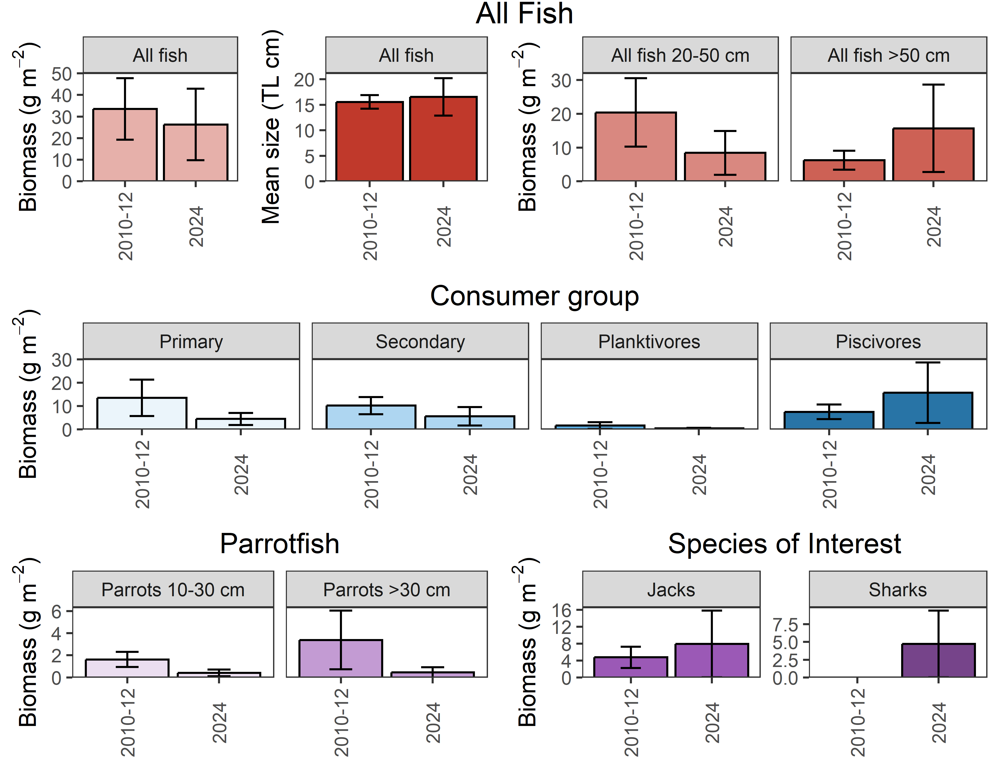
```



### Backreef habitat {.unnumbered}

table caption: Year surveyed and the number of sites.


```{r}
#| echo: false
#| message: false
#| warning: false
#| label: tbl-kur-bkr

# make a table of number of survey sites per year
site<-wsd %>% group_by(REGION, OBS_YEAR, ISLAND,REEF_ZONE,METHOD) %>% 
  count()
haw<-as.data.frame(site) %>% filter(ISLAND == "Kure"& REEF_ZONE == "Backreef") %>% dplyr::select(-c(REGION,ISLAND,REEF_ZONE,METHOD))%>% dplyr::rename(Year = OBS_YEAR, Sites = n) 
haw<-haw %>% filter(Sites>1)
t_haw<-as.data.frame(t(haw))
# Make the table, including:
# aligning the text in keeping with the PIFSC template
kable(t_haw,
      align = "rr")

```

```{r}
#| echo: false
#| label: fig-kur-bkr
#| fig-cap: "Hōlanikū backreef fish plots. Mean values ± standard error are plotted for biomass, mean size, and biomass per size class of all fishes observed (top); and biomass per consumer group (middle), parrotfish size classes (bottom left), and families of interest (bottom right)."
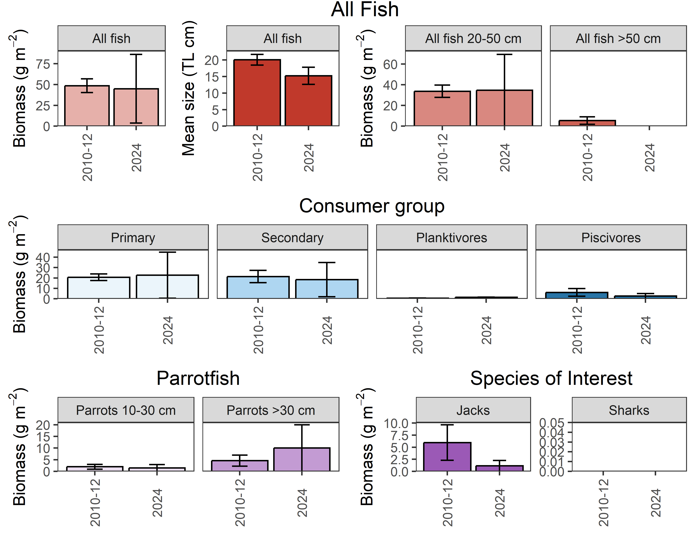
```



## Kamole (Laysan) {.unnumbered}

table caption: Year surveyed and the number of sites.


```{r}
#| echo: false
#| message: false
#| warning: false
#| label: tbl-lay

# Load the library we'll need
library(knitr)

# read in island data - number of surveys per year
library(dplyr)
load("data/Data Outputs/working_site_data.rdata")
# filter for after 2009
wsd<-wsd %>% filter(OBS_YEAR>2009)
# make a table of number of survey sites per year
site<-wsd %>% group_by(REGION, OBS_YEAR, ISLAND,METHOD) %>% 
  count()
haw<-as.data.frame(site) %>% filter(ISLAND == "Laysan") %>% dplyr::select(-c(REGION,ISLAND,METHOD))%>% dplyr::rename(Year = OBS_YEAR, Sites = n)
t_haw<-as.data.frame(t(haw))
# Make the table, aligning rr
kable(t_haw,
      align = "rr")
```

```{r}
#| echo: false
#| label: fig-lay-map
#| fig-cap: "Kamole site survey data by year. Each bubble represents a survey site and the size of the bubble corresponds to the total fish biomass at each site."
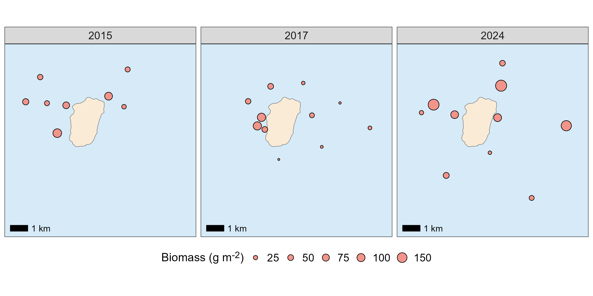
```

```{r}
#| echo: false
#| label: fig-lay
#| fig-cap: "Kamole fish plots. Mean values ± standard error are plotted for biomass, mean size, and biomass per size class of all fishes observed (top); and biomass per consumer group (middle), parrotfish size classes (bottom left), and families of interest (bottom right). The Hawai`i regional mean estimates of each metric are plotted for reference (horizontal gray line)."
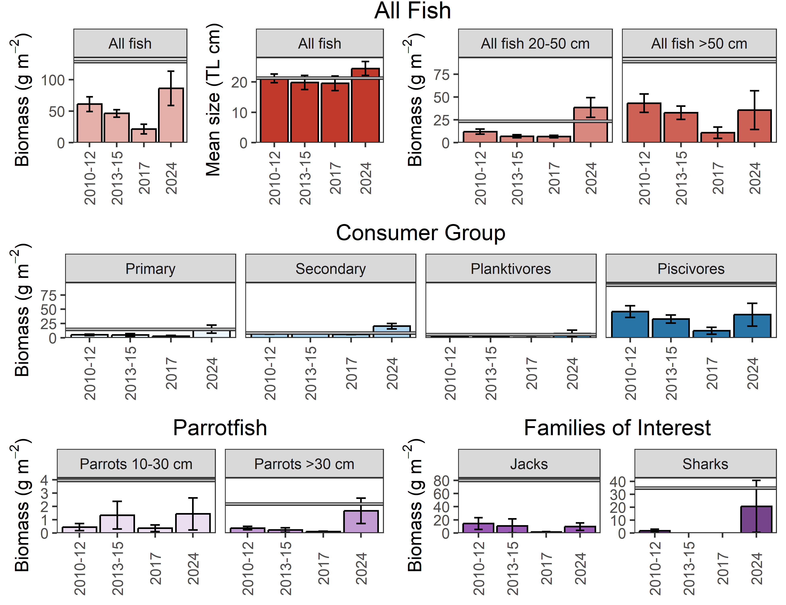
```



## Kapou (Lisianski) {.unnumbered}

table caption: Year surveyed and the number of sites.


```{r}
#| echo: false
#| message: false
#| warning: false
#| label: tbl-lis

# Load the library we'll need
library(knitr)

# read in island data - number of surveys per year
library(dplyr)
load("data/Data Outputs/working_site_data.rdata")
# filter for after 2009
wsd<-wsd %>% filter(OBS_YEAR>2009)
# make a table of number of survey sites per year
site<-wsd %>% group_by(REGION, OBS_YEAR, ISLAND,METHOD) %>% 
  count()
haw<-as.data.frame(site) %>% filter(ISLAND == "Lisianski") %>% dplyr::select(-c(REGION,ISLAND,METHOD))%>% dplyr::rename(Year = OBS_YEAR, Sites = n)
t_haw<-as.data.frame(t(haw))
# Make the table, aligning rr
kable(t_haw,
      align = "rr")
```

```{r}
#| echo: false
#| label: fig-lis-map
#| fig-cap: "Kapou site survey data by year. Each bubble represents a survey site and the size of the bubble corresponds to the total fish biomass at each site."
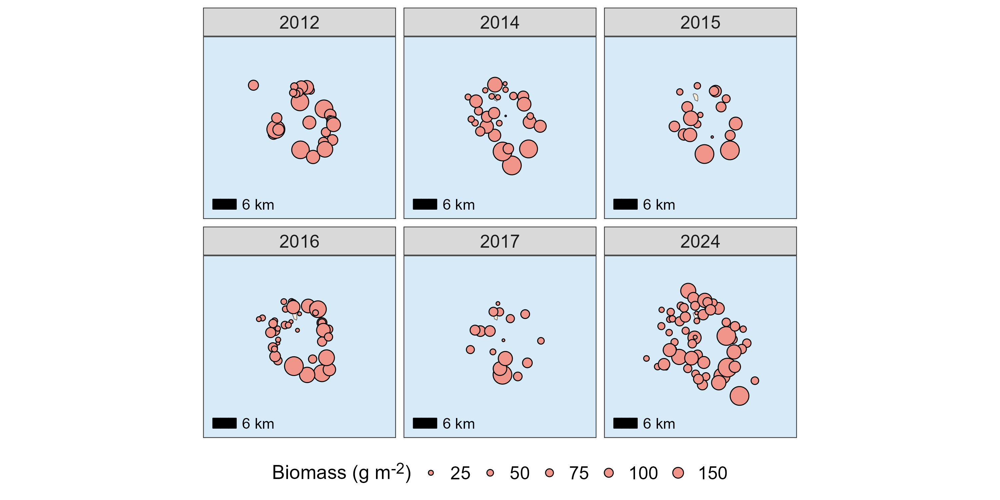
```

```{r}
#| echo: false
#| label: fig-lis
#| fig-cap: "Kapou fish plots. Mean values ± standard error are plotted for biomass, mean size, and biomass per size class of all fishes observed (top); and biomass per consumer group (middle), parrotfish size classes (bottom left), and families of interest (bottom right). The Hawai`i regional mean estimates of each metric are plotted for reference (horizontal gray line)."
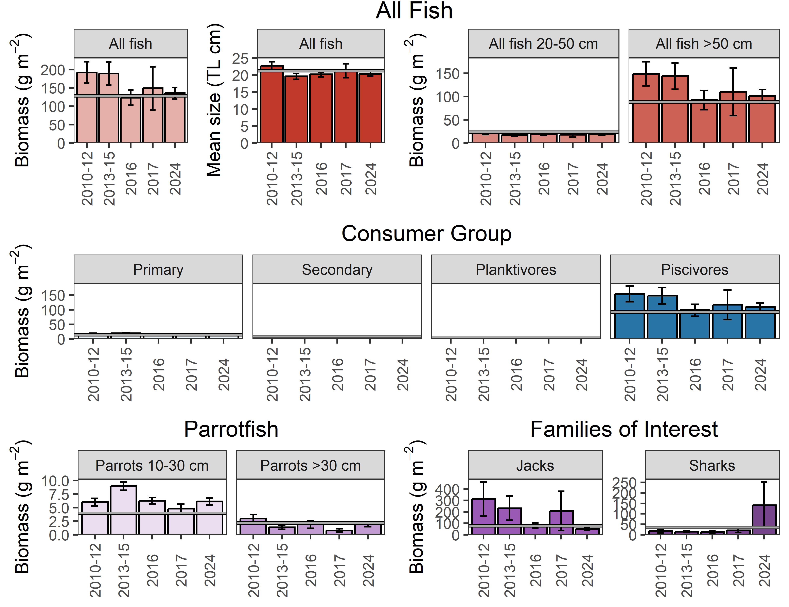
```

<!-- # Kuaihelani (Midway) {.unnumbered} -->

<!-- ```{r} -->
<!-- #| echo: false -->
<!-- #| message: false -->
<!-- #| warning: false -->
<!-- #| label: tbl-mid -->
<!-- #| tbl-cap: Year surveyed and the number of sites -->

<!-- # Load the library we'll need -->
<!-- library(knitr) -->

<!-- # read in island data - number of surveys per year -->
<!-- library(dplyr) -->
<!-- load("data/Data Outputs/working_site_data.rdata") -->
<!-- # filter for after 2009 -->
<!-- wsd<-wsd %>% filter(OBS_YEAR>2009) -->
<!-- # make a table of number of survey sites per year -->
<!-- site<-wsd %>% group_by(REGION, OBS_YEAR, ISLAND,METHOD) %>%  -->
<!--   count() -->
<!-- haw<-as.data.frame(site) %>% filter(ISLAND == "Midway") %>% dplyr::select(-c(REGION,ISLAND,METHOD))%>% dplyr::rename(Year = OBS_YEAR, Sites = n) -->
<!-- t_haw<-as.data.frame(t(haw)) -->
<!-- # Make the table, aligning rr -->
<!-- kable(t_haw, -->
<!--       align = "rr") -->
<!-- ``` -->


<!-- ```{r} -->
<!-- #| echo: false -->
<!-- #| label: fig-mid-map -->
<!-- #| fig-cap: "Kuaihelani site survey data by year. Each bubble represents a survey site and the size of the bubble corresponds to the total fish biomass at each site." -->
<!-- 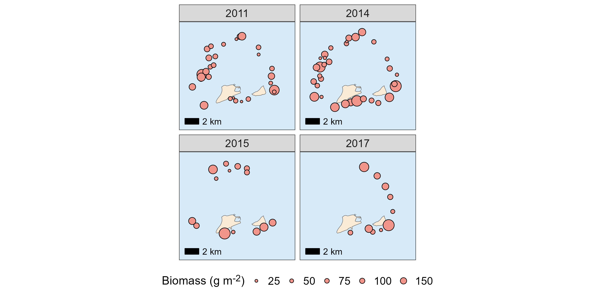 -->
<!-- ``` -->

<!-- Kuaihelani, also known as Midway Atoll, is further broken down into different habitat types or reef zones.   -->

<!-- Forereef habitat -->
<!-- ```{r} -->
<!-- #| echo: false -->
<!-- #| message: false -->
<!-- #| warning: false -->
<!-- #| label: tbl-mid-frf -->
<!-- #| tbl-cap: Year surveyed and the number of sites -->

<!-- # make a table of number of survey sites per year -->
<!-- site<-wsd %>% group_by(REGION, OBS_YEAR, ISLAND,REEF_ZONE,METHOD) %>%  -->
<!--   count() -->
<!-- haw<-as.data.frame(site) %>% filter(ISLAND == "Midway"& REEF_ZONE == "Forereef") %>% dplyr::select(-c(REGION,ISLAND,REEF_ZONE,METHOD))%>% dplyr::rename(Year = OBS_YEAR, Sites = n)  -->
<!-- haw<-haw %>% filter(Sites>1) -->
<!-- t_haw<-as.data.frame(t(haw)) -->
<!-- # Make the table, including: -->
<!-- # aligning the text in keeping with the PIFSC template -->
<!-- kable(t_haw, -->
<!--       align = "rr") -->

<!-- ``` -->

<!-- ```{r} -->
<!-- #| echo: false -->
<!-- #| label: fig-mid-frf -->
<!-- #| fig-cap: "Kuaihelani forereef fish plots. Mean values ± standard error are plotted for biomass, mean size, and biomass per size class of all fishes observed (top); and biomass per consumer group (middle), parrotfish size classes (bottom left), and families of interest (bottom right)." -->
<!-- 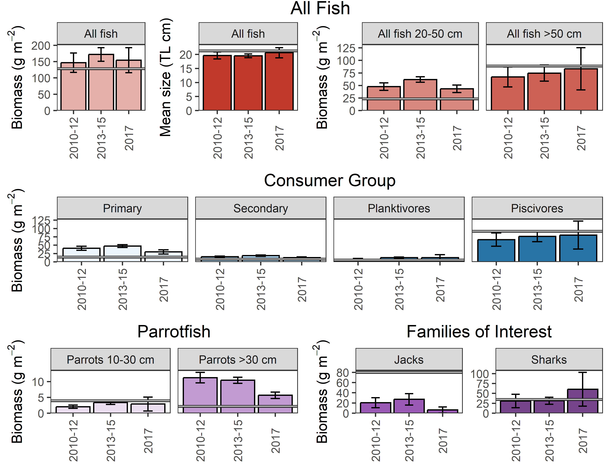 -->
<!-- ``` -->

<!-- Lagoon habitat -->
<!-- ```{r} -->
<!-- #| echo: false -->
<!-- #| message: false -->
<!-- #| warning: false -->
<!-- #| label: tbl-mid-lag -->
<!-- #| tbl-cap: Year surveyed and the number of sites -->

<!-- # make a table of number of survey sites per year -->
<!-- site<-wsd %>% group_by(REGION, OBS_YEAR, ISLAND,REEF_ZONE,METHOD) %>%  -->
<!--   count() -->
<!-- haw<-as.data.frame(site) %>% filter(ISLAND == "Midway"& REEF_ZONE == "Lagoon") %>% dplyr::select(-c(REGION,ISLAND,REEF_ZONE,METHOD))%>% dplyr::rename(Year = OBS_YEAR, Sites = n)  -->
<!-- haw<-haw %>% filter(Sites>1) -->
<!-- t_haw<-as.data.frame(t(haw)) -->
<!-- # Make the table -->
<!-- kable(t_haw, -->
<!--       align = "rr") -->
<!-- ``` -->
<!-- ```{r} -->
<!-- #| echo: false -->
<!-- #| label: fig-mid-lag -->
<!-- #| fig-cap: "Kuaihelani lagoon fish plots. Mean values ± standard error are plotted for biomass, mean size, and biomass per size class of all fishes observed (top); and biomass per consumer group (middle), parrotfish size classes (bottom left), and families of interest (bottom right)." -->
<!-- 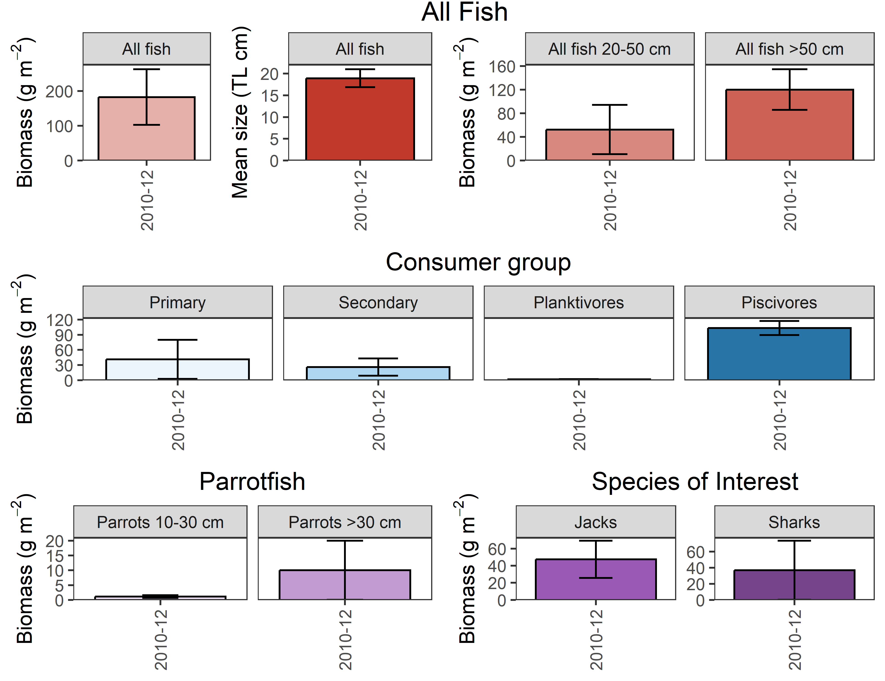 -->
<!-- ``` -->

<!-- Backreef habitat -->

<!-- ```{r} -->
<!-- #| echo: false -->
<!-- #| message: false -->
<!-- #| warning: false -->
<!-- #| label: tbl-mid-bkr -->
<!-- #| tbl-cap: Year surveyed and the number of sites -->

<!-- # make a table of number of survey sites per year -->
<!-- site<-wsd %>% group_by(REGION, OBS_YEAR, ISLAND,REEF_ZONE,METHOD) %>%  -->
<!--   count() -->
<!-- haw<-as.data.frame(site) %>% filter(ISLAND == "Midway"& REEF_ZONE == "Backreef") %>% dplyr::select(-c(REGION,ISLAND,REEF_ZONE,METHOD))%>% dplyr::rename(Year = OBS_YEAR, Sites = n)  -->
<!-- haw<-haw %>% filter(Sites>1) -->
<!-- t_haw<-as.data.frame(t(haw)) -->
<!-- # Make the table, including: -->
<!-- # aligning the text in keeping with the PIFSC template -->
<!-- kable(t_haw, -->
<!--       align = "rr") -->

<!-- ``` -->

<!-- ```{r} -->
<!-- #| echo: false -->
<!-- #| label: fig-mid-bkr -->
<!-- #| fig-cap: "Kuaihelani backreef fish plots. Mean values ± standard error are plotted for biomass, mean size, and biomass per size class of all fishes observed (top); and biomass per consumer group (middle), parrotfish size classes (bottom left), and families of interest (bottom right)." -->
<!-- 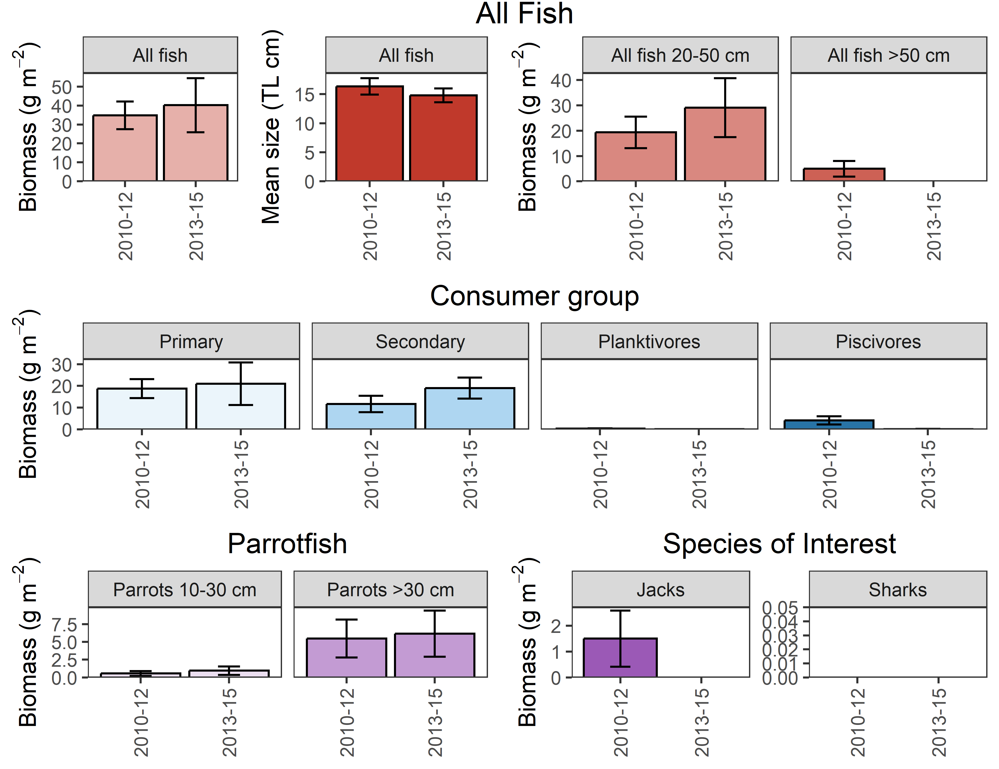 -->
<!-- ``` -->



## Lalo (French Frigate Shoals) {.unnumbered}

table caption: Year surveyed and the number of sites.

```{r}
#| echo: false
#| message: false
#| warning: false
#| label: tbl-ffs

# Load the library we'll need
library(knitr)

# read in island data - number of surveys per year
library(dplyr)
load("data/Data Outputs/working_site_data.rdata")
# filter for after 2009
wsd<-wsd %>% filter(OBS_YEAR>2009)
# make a table of number of survey sites per year
site<-wsd %>% group_by(REGION, OBS_YEAR, ISLAND,METHOD) %>% 
  count()
haw<-as.data.frame(site) %>% filter(ISLAND == "French Frigate") %>% dplyr::select(-c(REGION,ISLAND,METHOD))%>% dplyr::rename(Year = OBS_YEAR, Sites = n)
t_haw<-as.data.frame(t(haw))
# Make the table, including:
# renaming the columns (cols_label)
# aligning the text in keeping with the PIFSC template

kable(t_haw,
      align = "rr")
# kable(haw,
#       col.names = c('Year', 'Sites'),
#       align = "rr")

```

```{r}
#| echo: false
#| label: fig-ffs-map
#| fig-cap: "Lalo site survey data by year. Each bubble represents a survey site and the size of the bubble corresponds to the total fish biomass at each site."
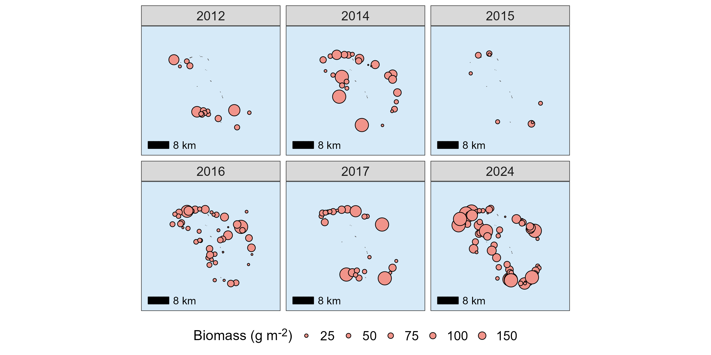
```

Lalo, also known as French Frigate Shoals, is further broken down into different habitat types or reef zones.  



### Forereef habitat{.unnumbered}

table caption: Year surveyed and the number of sites.


```{r}
#| echo: false
#| message: false
#| warning: false
#| label: tbl-ffs-frf

# make a table of number of survey sites per year
site<-wsd %>% group_by(REGION, OBS_YEAR, ISLAND,REEF_ZONE,METHOD) %>% 
  count()
haw<-as.data.frame(site) %>% filter(ISLAND == "French Frigate"& REEF_ZONE == "Forereef") %>% dplyr::select(-c(REGION,ISLAND,REEF_ZONE,METHOD))%>% dplyr::rename(Year = OBS_YEAR, Sites = n) 
haw<-haw %>% filter(Sites>1)
t_haw<-as.data.frame(t(haw))
# Make the table, including:
# renaming the columns (cols_label)
# aligning the text in keeping with the PIFSC template

kable(t_haw,
      align = "rr")

```

```{r}
#| echo: false
#| label: fig-ffs-frf
#| fig-cap: "Lalo forereef fish plots. Mean values ± standard error are plotted for biomass, mean size, and biomass per size class of all fishes observed (top); and biomass per consumer group (middle), parrotfish size classes (bottom left), and families of interest (bottom right). The Hawai`i regional mean estimates of each metric are plotted for reference (horizontal gray line)."
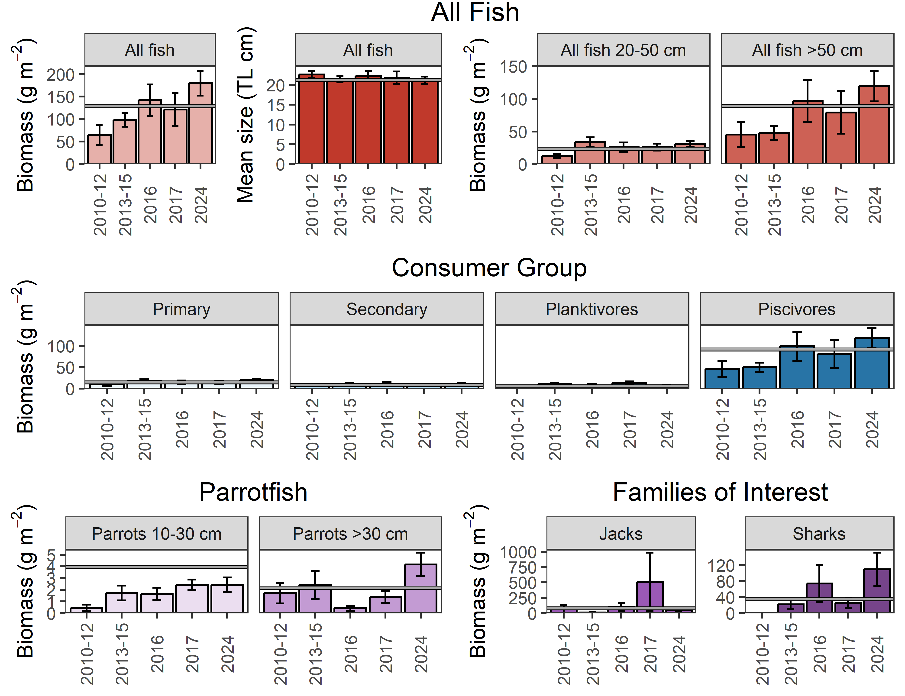
```



### Lagoon habitat{.unnumbered}

table caption: Year surveyed and the number of sites.

```{r}
#| echo: false
#| message: false
#| warning: false
#| label: tbl-ffs-lag

# make a table of number of survey sites per year
site<-wsd %>% group_by(REGION, OBS_YEAR, ISLAND,REEF_ZONE,METHOD) %>% 
  count()
haw<-as.data.frame(site) %>% filter(ISLAND == "French Frigate"& REEF_ZONE == "Lagoon") %>% dplyr::select(-c(REGION,ISLAND,REEF_ZONE,METHOD))%>% dplyr::rename(Year = OBS_YEAR, Sites = n) 
haw<-haw %>% filter(Sites>1)
t_haw<-as.data.frame(t(haw))
# Make the table, including:
# renaming the columns (cols_label)
# aligning the text in keeping with the PIFSC template

kable(t_haw,
      align = "rr")

```

```{r}
#| echo: false
#| label: fig-ffs-lag
#| fig-cap: "Lalo lagoon fish plots. Mean values ± standard error are plotted for biomass, mean size, and biomass per size class of all fishes observed (top); and biomass per consumer group (middle), parrotfish size classes (bottom left), and families of interest (bottom right)."
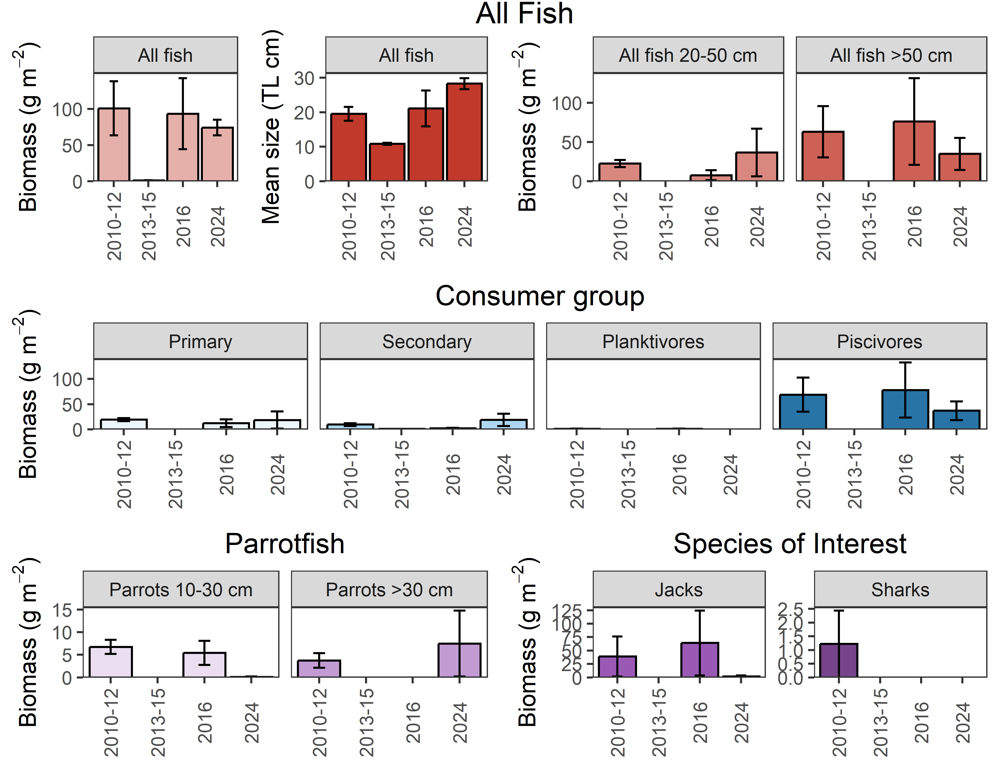
```



### Protected slope habitat{.unnumbered}

table caption: Year surveyed and the number of sites.

```{r}
#| echo: false
#| message: false
#| warning: false
#| label: tbl-ffs-ps

# make a table of number of survey sites per year
site<-wsd %>% group_by(REGION, OBS_YEAR, ISLAND,REEF_ZONE,METHOD) %>% 
  count()
haw<-as.data.frame(site) %>% filter(ISLAND == "French Frigate"& REEF_ZONE == "Protected Slope") %>% dplyr::select(-c(REGION,ISLAND,REEF_ZONE,METHOD))%>% dplyr::rename(Year = OBS_YEAR, Sites = n) 
haw<-haw %>% filter(Sites>1)
t_haw<-as.data.frame(t(haw))
# Make the table, including:
# renaming the columns (cols_label)
# aligning the text in keeping with the PIFSC template

kable(t_haw,
      align = "rr")

```

```{r}
#| echo: false
#| label: fig-ffs-ps
#| fig-cap: "Lalo protected slope fish plots. Mean values ± standard error are plotted for biomass, mean size, and biomass per size class of all fishes observed (top); and biomass per consumer group (middle), parrotfish size classes (bottom left), and families of interest (bottom right)."
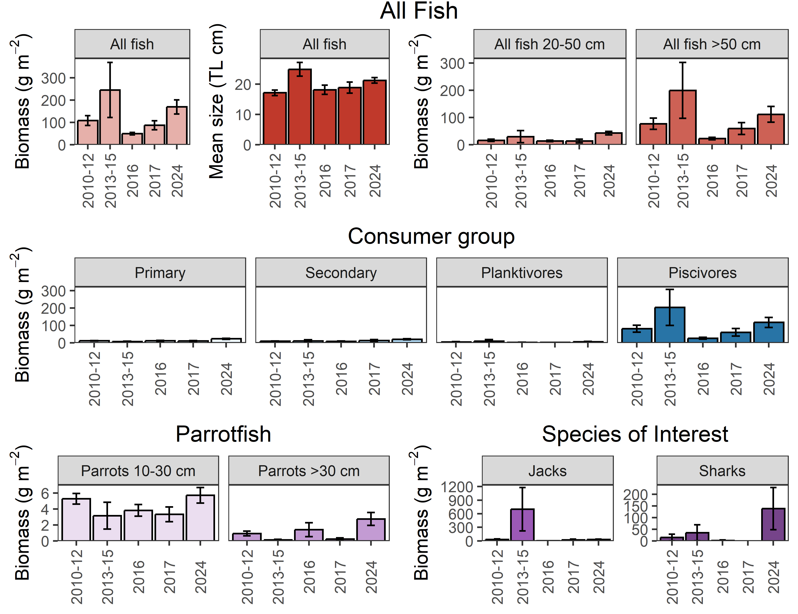
```



## Manawai (Pearl & Hermes) {.unnumbered}

table caption: Year surveyed and the number of sites.

```{r}
#| echo: false
#| message: false
#| warning: false
#| label: tbl-phr-frf

library(kableExtra)
# make a table of number of survey sites per year
site<-wsd %>% group_by(REGION, OBS_YEAR, ISLAND,METHOD) %>% 
  count()
haw<-as.data.frame(site) %>% filter(ISLAND == "Pearl & Hermes") %>% dplyr::select(-c(REGION,ISLAND,METHOD))%>% dplyr::rename(Year = OBS_YEAR, Sites = n) 
haw<-haw %>% filter(Sites>1)
t_haw<-as.data.frame(t(haw))
# Make the table, including:
# aligning the text in keeping with the PIFSC template
kable(t_haw,
      align = "rr")

```

```{r}
#| echo: false
#| label: fig-phr-map
#| fig-cap: "Manawai site survey data by year. Each bubble represents a survey site and the size of the bubble corresponds to the total fish biomass at each site."
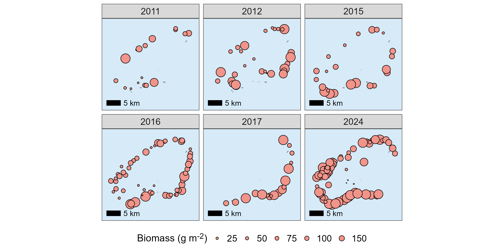
```

Manawai, also known as Pearl & Hermes, is further broken down into different habitat types or reef zones.



### Forereef habitat{.unnumbered}

```{r}
#| echo: false
#| message: false
#| warning: false
#| label: tbl-phr-frf

# make a table of number of survey sites per year
site<-wsd %>% group_by(REGION, OBS_YEAR, ISLAND,REEF_ZONE,METHOD) %>% 
  count()
haw<-as.data.frame(site) %>% filter(ISLAND == "Pearl & Hermes"& REEF_ZONE == "Forereef") %>% dplyr::select(-c(REGION,ISLAND,REEF_ZONE,METHOD))%>% dplyr::rename(Year = OBS_YEAR, Sites = n) 
haw<-haw %>% filter(Sites>1)
t_haw<-as.data.frame(t(haw))
# Make the table, including:
# aligning the text in keeping with the PIFSC template
kable(t_haw,
      align = "rr")

```

```{r}
#| echo: false
#| label: fig-phr-frf
#| fig-cap: "Manawai forereef fish plots. Mean values ± standard error are plotted for biomass, mean size, and biomass per size class of all fishes observed (top); and biomass per consumer group (middle), parrotfish size classes (bottom left), and families of interest (bottom right). The Hawai`i regional mean estimates of each metric are plotted for reference (horizontal gray line)."
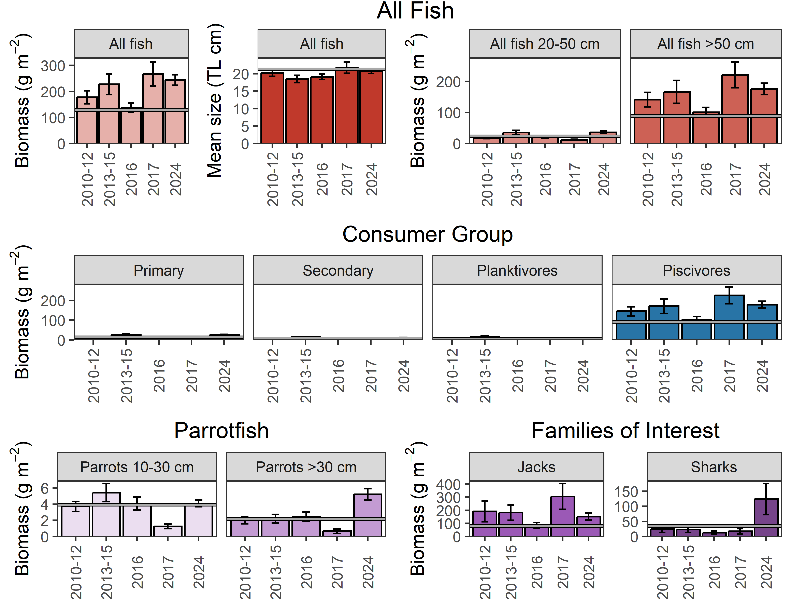
```



### Lagoon habitat{.unnumbered}

table caption: Year surveyed and the number of sites.

```{r}
#| echo: false
#| message: false
#| warning: false
#| label: tbl-phr-lag

# make a table of number of survey sites per year
site<-wsd %>% group_by(REGION, OBS_YEAR, ISLAND,REEF_ZONE,METHOD) %>% 
  count()
haw<-as.data.frame(site) %>% filter(ISLAND == "Pearl & Hermes"& REEF_ZONE == "Lagoon") %>% dplyr::select(-c(REGION,ISLAND,REEF_ZONE,METHOD))%>% dplyr::rename(Year = OBS_YEAR, Sites = n) 
haw<-haw %>% filter(Sites>1)
t_haw<-as.data.frame(t(haw))
# Make the table, including:
# aligning the text in keeping with the PIFSC template
kable(t_haw,
      align = "rr")

```

```{r}
#| echo: false
#| label: fig-phr-lag
#| fig-cap: "Manawai lagoon fish plots. Mean values ± standard error are plotted for biomass, mean size, and biomass per size class of all fishes observed (top); and biomass per consumer group (middle), parrotfish size classes (bottom left), and families of interest (bottom right)."
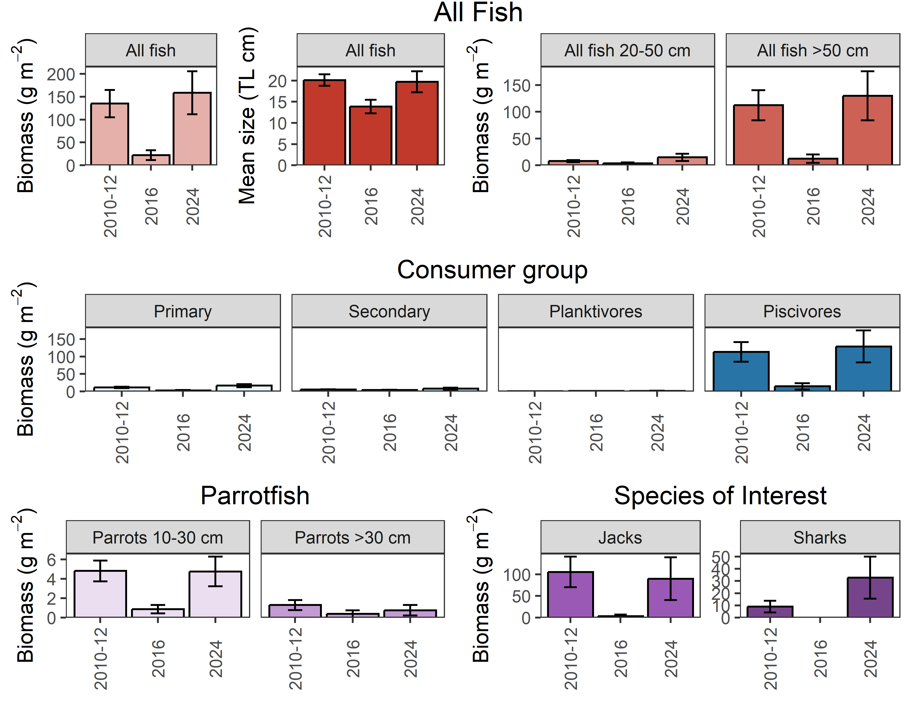
```



### Backreef habitat{.unnumbered}

table caption: Year surveyed and the number of sites.

```{r}
#| echo: false
#| message: false
#| warning: false
#| label: tbl-phr-bkr

# make a table of number of survey sites per year
site<-wsd %>% group_by(REGION, OBS_YEAR, ISLAND,REEF_ZONE,METHOD) %>% 
  count()
haw<-as.data.frame(site) %>% filter(ISLAND == "Pearl & Hermes"& REEF_ZONE == "Backreef") %>% dplyr::select(-c(REGION,ISLAND,REEF_ZONE,METHOD))%>% dplyr::rename(Year = OBS_YEAR, Sites = n) 
haw<-haw %>% filter(Sites>1)
t_haw<-as.data.frame(t(haw))
# Make the table, including:
# aligning the text in keeping with the PIFSC template
kable(t_haw,
      align = "rr")

```

```{r}
#| echo: false
#| label: fig-phr-bkr
#| fig-cap: "Manawai backreef fish plots. Mean values ± standard error are plotted for biomass, mean size, and biomass per size class of all fishes observed (top); and biomass per consumer group (middle), parrotfish size classes (bottom left), and families of interest (bottom right)."
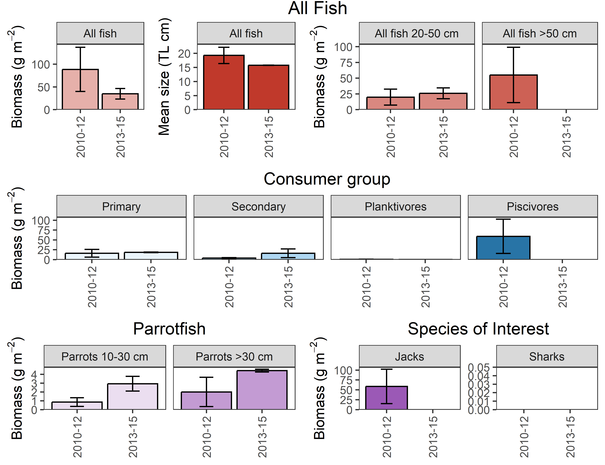
```



# Acknowledgements

Thanks to all those onboard the NOAA Ship *Oscar Elton Sette* for their logistical and field support during the `r ReportYear` Pacific NCRMP research cruise and to the following divers for their assistance with data collection: Candace Alagata, Corinne Amir, Isabelle Basden, Raymond Boland,  Jonny Charendoff, Matthew Chauvin, Chelsie Counsell, Daniela Escontrela-Dieguez, Laura Gajdzik, Alexa Gonzales, Aralyn Hacker, Ari Halperin, Lori Luers, Tye Kindinger, Mia Lamirand, Roseanna Lee, Sydney Luitgaarden, Makoa Pascoe, Jake Richard, Andrew Shantz, Jan Willem Staman, Juliette Verstaen, Pearl Thompson, Rebecca Weible, and Heather Ylitalo-Ward. We thank the staff of the NOAA PIFSC ESD ARP for assistance in the field and data management. This work was funded by the NOAA Coral Reef Conservation Program (CRCP Project #322) and the NOAA PIFSC. 
Report, figures, and maps were compiled by K. McCoy. 